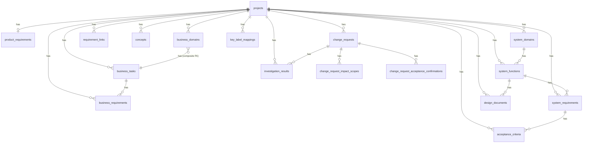

# データベーススキーマ設計書

## 目的

要件管理システムのデータ永続化レイヤーを設計し、業務要件とシステム要件の体系的な管理を実現する。
Supabase（PostgreSQL）をバックエンドとして使用し、フロントエンド（Next.js）からの直接アクセスを前提とする。

## 基本方針

- **ID採番**: アプリ側で行う（例: `TASK-001`, `BR-TASK-001-001`, `SRF-001`, `DD-001`）
- **マルチプロジェクト対応**: 全テーブルに `project_id` を追加し、プロジェクト単位のデータ分離を実現
- **構造化データ**: JSONBを使用（設計書詳細、入出力定義、コアロジック等）
- **RLS**: 全テーブルで有効化（開発時は匿名アクセス許可、本番では認証必須）
- **外部キー制約**: CASCADE DELETEを使用

## ID採番規約

全エンティティのIDはアプリ側で生成する。採番ロジックは `lib/data/id.ts` および `lib/utils/id-rules.ts` に集約。

| エンティティ | フォーマット | 例 | 備考 |
|-------------|-------------|-----|------|
| 業務タスク (BT) | `BT-{AREA}-{NNNN}` | BT-AR-0001 | {AREA}: 業務領域コード（AR/AP/GL等） |
| 業務要件 (BR) | `BR-{AREA}-{TASK_NUM}-{SEQ}` | BR-AR-0001-0001 | {TASK_NUM}: 紐づくBTの番号 |
| システム機能 (SF) | `SF-{AREA}-{NNNN}` | SF-AR-0001 | - |
| システム要件 (SR) | `SR-{AREA}-{FUNC_NUM}-{SEQ}` | SR-AR-0001-0001 | {FUNC_NUM}: 紐づくSFの番号 |
| 設計書 (DD) | `DD-{NNN}` | DD-001 | プロジェクト単位の連番 |
| 受入条件 (AC) | `AC-{NNN}` | AC-001 | プロジェクト単位の連番 |
| 概念 (C) | `C{NNN}` | C001 | ハイフンなし |
| 変更要求 (CR) | `CR-{NNN}` | CR-001 | プロジェクト単位の連番 |
| 製品要件 (PR) | `PR` | PR | 固定値（プロジェクトにつき1件） |

**採番ルール**:
- `{NNNN}`: 0埋め4桁の連番
- `{SEQ}`: 0埋め4桁のシーケンス番号
- 採番は各テーブルの既存最大番号 + 1 で行う
- 実装: `lib/data/id.ts` の `generateId()` および各エンティティ別の採番関数を参照

---

## テーブル定義一覧

全18テーブルを以下のカテゴリに分類する：

| カテゴリ | テーブル数 | テーブル |
|----------|------------|----------|
| プロジェクト管理 | 2 | `projects`, `product_requirements` |
| 業務要件系 | 3 | `business_domains`, `business_tasks`, `business_requirements` |
| システム要件系 | 4 | `system_domains`, `system_functions`, `system_requirements`, `acceptance_criteria` |
| 設計・連携系 | 4 | `design_documents`, `requirement_links`, `concepts` |
| 変更管理系 | 5 | `change_requests`, `change_request_impact_scopes`, `change_request_acceptance_confirmations`, `investigation_results`, `key_label_mappings` |

---

## ER図（Mermaid）



---

## テーブル定義詳細

### 1. プロジェクト管理系

#### 1.1 projects（プロジェクト）

プロジェクト本体を管理するテーブル。

| カラム名 | 型 | NOT NULL | DEFAULT | 説明 |
|----------|-----|----------|---------|------|
| id | uuid | PK | gen_random_uuid() | 一意識別子 |
| name | text | ✔ | - | プロジェクト名 |
| description | text | - | - | 説明 |
| github_url | text | - | - | GitHubリポジトリURL |
| review_link_threshold | text | ✔ | 'medium' | 要確認リンク判定基準: low/medium/high |
| auto_save | boolean | ✔ | true | 自動保存有効フラグ |
| created_at | timestamptz | ✔ | now() | 作成日時 |
| updated_at | timestamptz | ✔ | now() | 更新日時 |

**制約**:
- CHECK: `review_link_threshold IN ('low', 'medium', 'high')`

**インデックス**:
- `idx_projects_name`: (name)

---

#### 1.2 product_requirements（製品要件）

製品要件（PRD）を管理するテーブル。

| カラム名 | 型 | NOT NULL | DEFAULT | 説明 |
|----------|-----|----------|---------|------|
| id | text | PK | - | 一意識別子（'PR' 固定または拡張） |
| project_id | uuid | FK → projects(id) | - | 所属プロジェクト |
| target_users | text | ✔ | '' | 対象ユーザー |
| experience_goals | text | ✔ | '' | 体験目標 |
| quality_goals | text | ✔ | '' | 品質目標 |
| design_system | text | ✔ | '' | デザインシステム |
| ux_guidelines | text | ✔ | '' | UXガイドライン |
| tech_stack_profile | jsonb | ✔ | '{}' | 技術スタックプロファイル |
| coding_conventions | jsonb | - | - | コーディング規約 |
| forbidden_choices | jsonb | - | - | 禁止事項 |
| created_at | timestamptz | ✔ | now() | 作成日時 |
| updated_at | timestamptz | ✔ | now() | 更新日時 |

**制約**:
- UNIQUE: (project_id)
- FK: `project_id` → `projects(id)` ON DELETE CASCADE

**インデックス**:
- `idx_product_requirements_project_id`: (project_id) UNIQUE

---

### 2. 業務要件系

#### 2.1 business_domains（業務領域マスタ）

業務領域の分類管理を行うマスタテーブル。

| カラム名 | 型 | NOT NULL | DEFAULT | 説明 |
|----------|-----|----------|---------|------|
| project_id | uuid | PK(1) | - | 所属プロジェクト |
| area | text | PK(2) | - | 業務領域コード（AR/AP/GL等） |
| name | text | ✔ | - | 業務名 |
| summary | text | ✔ | - | 業務概要 |
| business_req_count | integer | ✔ | 0 | 業務要件数 |
| system_req_count | integer | ✔ | 0 | システム要件数 |
| created_at | timestamptz | ✔ | now() | 作成日時 |
| updated_at | timestamptz | ✔ | now() | 更新日時 |

**主キー**: 複合主キー `(project_id, area)`

---

#### 2.2 business_tasks（業務タスク）

業務プロセスの最小単位を管理するテーブル。

| カラム名 | 型 | NOT NULL | DEFAULT | 説明 |
|----------|-----|----------|---------|------|
| id | text | PK | - | 一意識別子（TASK-XXX形式） |
| project_id | uuid | FK → projects(id) | ✔ | - | 所属プロジェクト |
| business_area | text | FK → business_domains(area) | ✔ | - | 所属業務領域 |
| name | text | ✔ | - | タスク名（20字以内） |
| summary | text | ✔ | - | 業務概要＋業務フロー（Markdown） |
| business_context | text | - | - | 業務コンテキスト |
| process_steps | jsonb | - | - | プロセスステップ（JSONB化） |
| input | jsonb | - | - | 業務インプット（JSONB化） |
| output | jsonb | - | - | 業務アウトプット（JSONB化） |
| concepts | text[] | ✔ | '{}' | 関連概念ID配列 |
| concept_ids_yaml | text | - | - | 概念ID YAML形式 |
| person | text | - | - | 主担当者（ロール名） |
| sort_order | integer | ✔ | 0 | 表示順 |
| created_at | timestamptz | ✔ | now() | 作成日時 |
| updated_at | timestamptz | ✔ | now() | 更新日時 |

**外部キー**:
- `project_id` → `projects(id)` ON DELETE CASCADE
- 複合FK: `(project_id, business_area)` → `business_domains(project_id, area)` ON DELETE CASCADE ON UPDATE CASCADE

**インデックス**:
- `idx_business_tasks_project_id`: (project_id)
- `tasks_business_area_idx`: (business_area)

---

#### 2.3 business_requirements（業務要件）

業務タスクを満たすための具体的な要件を管理するテーブル。

| カラム名 | 型 | NOT NULL | DEFAULT | 説明 |
|----------|-----|----------|---------|------|
| id | text | PK | - | 一意識別子（BR-TASK-XXX-XXX形式） |
| project_id | uuid | FK → projects(id) | ✔ | - | 所属プロジェクト |
| business_task_id | text | FK → business_tasks(id) | ✔ | - | 所属業務タスク |
| code | text | ✔ | - | コード |
| requirement | text | ✔ | - | 要件名（「〜できること」形式、30字以内） |
| rationale | text | ✔ | - | 要件詳細（100〜200字） |
| concept_ids | text[] | ✔ | '{}' | 関連概念ID配列 |
| created_at | timestamptz | ✔ | now() | 作成日時 |
| updated_at | timestamptz | ✔ | now() | 更新日時 |

**外部キー**:
- `project_id` → `projects(id)` ON DELETE CASCADE
- `business_task_id` → `business_tasks(id)` ON DELETE CASCADE

**インデックス**:
- `idx_business_requirements_project_id`: (project_id)

**削除された列**（Phase 2で削除）:
- ~~summary~~
- ~~priority~~
- ~~acceptance_criteria~~ (text[])
- ~~acceptance_criteria_json~~ (jsonb)

---

### 3. システム要件系

#### 3.1 system_domains（システム領域マスタ）

システム領域の分類を管理するマスタテーブル。

| カラム名 | 型 | NOT NULL | DEFAULT | 説明 |
|----------|-----|----------|---------|------|
| id | text | PK | - | 一意識別子（AR/AP/GLなど） |
| project_id | uuid | FK → projects(id) | ✔ | - | 所属プロジェクト |
| name | text | ✔ | - | システム領域名 |
| description | text | ✔ | '' | 説明 |
| sort_order | integer | ✔ | 0 | 表示順 |
| created_at | timestamptz | ✔ | now() | 作成日時 |
| updated_at | timestamptz | ✔ | now() | 更新日時 |

**外部キー**:
- `project_id` → `projects(id)` ON DELETE CASCADE

**インデックス**:
- `idx_system_domains_project_id`: (project_id)
- `idx_system_domains_sort_order`: (sort_order)

---

#### 3.2 system_functions（システム機能）

業務機能を実現するためのシステム機能を管理するテーブル。

| カラム名 | 型 | NOT NULL | DEFAULT | 説明 |
|----------|-----|----------|---------|------|
| id | text | PK | - | 一意識別子（SRF-XXX形式） |
| project_id | uuid | FK → projects(id) | ✔ | - | 所属プロジェクト |
| system_domain_id | text | FK → system_domains(id) | ✔ | - | 所属システム領域 |
| code | text | ✔ | - | コード |
| name | text | ✔ | - | 機能名（30字以内） |
| description | text | ✔ | - | 機能概要（200字程度） |
| concept_ids | text[] | ✔ | '{}' | 関連概念ID配列 |
| design_policy | text | ✔ | '' | 設計方針 |
| entry_points | jsonb | ✔ | '[]' | エントリポイント配列（legacy） |
| system_design | jsonb | ✔ | '[]' | 設計項目配列（legacy） |
| code_refs | jsonb | ✔ | '[]' | 実装参照配列（legacy） |
| created_at | timestamptz | ✔ | now() | 作成日時 |
| updated_at | timestamptz | ✔ | now() | 更新日時 |

**外部キー**:
- `project_id` → `projects(id)` ON DELETE CASCADE
- `system_domain_id` → `system_domains(id)`

**インデックス**:
- `idx_system_functions_project_id`: (project_id)

**削除された列**（2026-02-07削除）:
- ~~deliverables~~ (jsonb) - design_documents側で管理

**備考**: 設計詳細は `design_documents` テーブルで管理する。

---

#### 3.3 system_requirements（システム要件）

システム機能を満たすための技術要件を管理するテーブル。

| カラム名 | 型 | NOT NULL | DEFAULT | 説明 |
|----------|-----|----------|---------|------|
| id | text | PK | - | 一意識別子（SR-TASK-XXX-XXX形式） |
| project_id | uuid | FK → projects(id) | ✔ | - | 所属プロジェクト |
| system_function_id | text | FK → system_functions(id) | ✔ | - | 所属システム機能 |
| code | text | ✔ | - | コード |
| type | text | ✔ | 'function' | 観点種別 |
| requirement | text | ✔ | - | 要件名（「〜できること」形式、30字以内） |
| rationale | text | ✔ | - | 要件詳細（100〜200字） |
| concept_ids | text[] | ✔ | '{}' | 関連概念ID配列 |
| acceptance_criteria | text[] | ✔ | '{}' | 受入条件（legacy） |
| acceptance_criteria_json | jsonb | ✔ | '[]' | 受入条件（構造化） |
| sort_order | integer | ✔ | 0 | 表示順 |
| created_at | timestamptz | ✔ | now() | 作成日時 |
| updated_at | timestamptz | ✔ | now() | 更新日時 |

**外部キー**:
- `project_id` → `projects(id)` ON DELETE CASCADE
- `system_function_id` → `system_functions(id)` ON DELETE CASCADE

**制約**:
- CHECK: `type IN ('function', 'data', 'exception', 'non_functional')`

**インデックス**:
- `idx_system_requirements_project_id`: (project_id)

**削除された列**:
- ~~business_requirement_ids~~ (text[]) - requirement_linksで管理
- ~~related_deliverable_ids~~ (text[]) - 2026-02-07削除

---

#### 3.4 acceptance_criteria（受入条件）

システム要件の受入条件を管理する独立テーブル。

| カラム名 | 型 | NOT NULL | DEFAULT | 説明 |
|----------|-----|----------|---------|------|
| id | text | PK | - | 一意識別子（AC-XXX形式） |
| system_requirement_id | text | FK → system_requirements(id) | ✔ | - | 所属システム要件 |
| project_id | uuid | FK → projects(id) | ✔ | - | 所属プロジェクト |
| description | text | ✔ | - | 説明 |
| given_text | text | - | - | Given（前提条件） |
| when_text | text | - | - | When（操作） |
| then_text | text | - | - | Then（期待結果） |
| verification_method | text | - | - | 検証方法 |
| status | text | ✔ | 'unverified' | ステータス |
| verified_by | text | - | - | 検証者 |
| verified_at | timestamptz | - | - | 検証日時 |
| evidence | text | - | - | エビデンス |
| sort_order | integer | ✔ | 0 | 表示順 |
| created_at | timestamptz | ✔ | now() | 作成日時 |
| updated_at | timestamptz | ✔ | now() | 更新日時 |

**外部キー**:
- `system_requirement_id` → `system_requirements(id)` ON DELETE CASCADE
- `project_id` → `projects(id)` ON DELETE CASCADE

**インデックス**:
- `idx_acceptance_criteria_project_id`: (project_id)
- `idx_acceptance_criteria_system_requirement_id`: (system_requirement_id)

---

### 4. 設計・連携系

#### 4.1 design_documents（設計書）

設計書（旧 impl_unit_sds）を管理するテーブル。

| カラム名 | 型 | NOT NULL | DEFAULT | 説明 |
|----------|-----|----------|---------|------|
| id | text | PK | - | 一意識別子（DD-XXX形式） |
| srf_id | text | FK → system_functions(id) | ✔ | - | 所属システム機能 |
| project_id | uuid | FK → projects(id) | ✔ | - | 所属プロジェクト |
| name | text | ✔ | - | 設計書名 |
| type | text | ✔ | 'screen' | 種別 |
| summary | text | ✔ | '' | 概要 |
| entry_points | jsonb | ✔ | '[]' | エントリポイント配列 |
| design_policy | text | ✔ | '' | 設計方針 |
| details | jsonb | ✔ | '{}' | 設計詳細（StructuredDesignDocumentSpec） |
| created_at | timestamptz | ✔ | now() | 作成日時 |
| updated_at | timestamptz | ✔ | now() | 更新日時 |

**外部キー**:
- `srf_id` → `system_functions(id)` ON DELETE CASCADE
- `project_id` → `projects(id)` ON DELETE CASCADE

**インデックス**:
- `idx_design_documents_project_id`: (project_id)
- `idx_design_documents_srf_id`: (srf_id)

**details JSONB**: `StructuredDesignDocumentSpec` 型（後述）

---

#### 4.2 requirement_links（要件関連付け）

要件間の関連を管理するテーブル。

| カラム名 | 型 | NOT NULL | DEFAULT | 説明 |
|----------|-----|----------|---------|------|
| id | uuid | PK | gen_random_uuid() | 一意識別子 |
| project_id | uuid | FK → projects(id) | ✔ | - | 所属プロジェクト |
| source_type | text | ✔ | - | ソース種別 |
| source_id | text | ✔ | - | ソースID |
| target_type | text | ✔ | - | ターゲット種別 |
| target_id | text | ✔ | - | ターゲットID |
| link_type | text | ✔ | - | リンク種別 |
| suspect | boolean | ✔ | false | 要確認フラグ |
| suspect_reason | text | - | - | 要確認理由 |
| created_at | timestamptz | ✔ | now() | 作成日時 |
| updated_at | timestamptz | ✔ | now() | 更新日時 |

**外部キー**:
- `project_id` → `projects(id)` ON DELETE CASCADE

**インデックス**:
- `idx_requirement_links_project_id`: (project_id)
- `idx_requirement_links_source`: (source_type, source_id)
- `idx_requirement_links_target`: (target_type, target_id)

---

#### 4.3 concepts（概念辞書）

業務/システムで使用される用語・概念を管理する辞書テーブル。

| カラム名 | 型 | NOT NULL | DEFAULT | 説明 |
|----------|-----|----------|---------|------|
| id | text | PK | - | 一意識別子（C-XXX形式） |
| project_id | uuid | FK → projects(id) | ✔ | - | 所属プロジェクト |
| name | text | ✔ | - | 概念名（正式名称） |
| synonyms | text[] | ✔ | '{}' | 同義語・別名配列 |
| areas | text[] | ✔ | '{}' | 影響するシステム領域（AR/AP/GL） |
| definition | text | ✔ | '' | 定義（Markdown） |
| related_docs | text[] | ✔ | '{}' | 必読ドキュメントパス |
| requirement_count | integer | ✔ | 0 | 使用要件数 |
| created_at | timestamptz | ✔ | now() | 作成日時 |
| updated_at | timestamptz | ✔ | now() | 更新日時 |

**外部キー**:
- `project_id` → `projects(id)` ON DELETE CASCADE

**インデックス**:
- `idx_concepts_project_id`: (project_id)
- `idx_concepts_areas`: (areas)
- `idx_concepts_name`: (name)

---

### 5. 変更管理系

#### 5.1 change_requests（変更要求）

変更要求チケットを管理するテーブル。

| カラム名 | 型 | NOT NULL | DEFAULT | 説明 |
|----------|-----|----------|---------|------|
| id | uuid | PK | gen_random_uuid() | 一意識別子 |
| ticket_id | text | UNIQUE | ✔ | - | チケットID（CR-XXX形式） |
| project_id | uuid | FK → projects(id) | ✔ | - | 所属プロジェクト |
| title | text | ✔ | - | タイトル |
| description | text | - | - | 説明 |
| background | text | - | - | 背景 |
| expected_benefit | text | - | - | 期待効果 |
| status | text | ✔ | 'open' | ステータス |
| priority | text | ✔ | 'medium' | 優先度 |
| requested_by | text | - | - | 要求者 |
| created_at | timestamptz | ✔ | now() | 作成日時 |
| updated_at | timestamptz | ✔ | now() | 更新日時 |

**外部キー**:
- `project_id` → `projects(id)` ON DELETE CASCADE

**制約**:
- UNIQUE: (ticket_id)
- CHECK: `status IN ('open', 'review', 'approved', 'applied')`
- CHECK: `priority IN ('low', 'medium', 'high')`

**インデックス**:
- `idx_change_requests_ticket_id`: (ticket_id)
- `idx_change_requests_status`: (status)
- `idx_change_requests_created_at`: (created_at DESC)

---

#### 5.2 change_request_impact_scopes（変更影響範囲）

変更要求の影響範囲を管理するテーブル。

| カラム名 | 型 | NOT NULL | DEFAULT | 説明 |
|----------|-----|----------|---------|------|
| id | uuid | PK | gen_random_uuid() | 一意識別子 |
| change_request_id | uuid | FK → change_requests(id) | ✔ | - | 変更要求ID |
| target_type | text | ✔ | - | ターゲット種別 |
| target_id | text | ✔ | - | ターゲットID |
| target_title | text | ✔ | - | ターゲット名 |
| rationale | text | - | - | 理由 |
| confirmed | boolean | ✔ | false | 確認フラグ |
| confirmed_by | text | - | - | 確認者 |
| confirmed_at | timestamptz | - | - | 確認日時 |
| created_at | timestamptz | ✔ | now() | 作成日時 |
| updated_at | timestamptz | ✔ | now() | 更新日時 |

**外部キー**:
- `change_request_id` → `change_requests(id)` ON DELETE CASCADE

**制約**:
- CHECK: `target_type IN ('business_requirement', 'system_requirement', 'system_function', 'file')`

**インデックス**:
- `idx_change_request_impact_scopes_change_request_id`: (change_request_id)
- `idx_change_request_impact_scopes_target`: (target_type, target_id)

---

#### 5.3 change_request_acceptance_confirmations（変更受入確認）

変更要求の受入確認を管理するテーブル。

| カラム名 | 型 | NOT NULL | DEFAULT | 説明 |
|----------|-----|----------|---------|------|
| id | uuid | PK | gen_random_uuid() | 一意識別子 |
| change_request_id | uuid | FK → change_requests(id) | ✔ | - | 変更要求ID |
| acceptance_criterion_id | text | ✔ | - | 受入条件ID |
| acceptance_criterion_source_type | text | ✔ | - | ソース種別 |
| acceptance_criterion_source_id | text | ✔ | - | ソースID |
| acceptance_criterion_description | text | ✔ | - | 受入条件説明 |
| acceptance_criterion_verification_method | text | - | - | 検証方法 |
| status | text | ✔ | 'unverified' | ステータス |
| verified_by | text | - | - | 検証者 |
| verified_at | timestamptz | - | - | 検証日時 |
| evidence | text | - | - | エビデンス |
| created_at | timestamptz | ✔ | now() | 作成日時 |
| updated_at | timestamptz | ✔ | now() | 更新日時 |

**外部キー**:
- `change_request_id` → `change_requests(id)` ON DELETE CASCADE

**制約**:
- UNIQUE: (change_request_id, acceptance_criterion_id)
- CHECK: `status IN ('unverified', 'verified_ok', 'verified_ng')`
- CHECK: `acceptance_criterion_source_type IN ('business_requirement', 'system_requirement')`

**インデックス**:
- `idx_change_request_acceptance_confirmations_change_request_id`: (change_request_id)
- `idx_change_request_acceptance_confirmations_source`: (acceptance_criterion_source_type, acceptance_criterion_source_id)
- `idx_change_request_acceptance_confirmations_status`: (status)

---

#### 5.4 investigation_results（影響調査結果）

影響調査結果を保持するテーブル（Phase 5追加）。

| カラム名 | 型 | NOT NULL | DEFAULT | 説明 |
|----------|-----|----------|---------|------|
| id | uuid | PK | gen_random_uuid() | 一意識別子 |
| change_request_id | uuid | FK → change_requests(id) | ✔ | - | 変更要求ID |
| project_id | uuid | FK → projects(id) | ✔ | - | 所属プロジェクト |
| status | text | ✔ | 'pending' | ステータス |
| top_down_result | jsonb | - | - | トップダウン結果 |
| suspect_links_detected | jsonb | ✔ | '[]' | 検出された要確認リンク |
| created_at | timestamptz | ✔ | now() | 作成日時 |
| updated_at | timestamptz | ✔ | now() | 更新日時 |

**外部キー**:
- `change_request_id` → `change_requests(id)` ON DELETE CASCADE
- `project_id` → `projects(id)` ON DELETE CASCADE

**制約**:
- CHECK: `status IN ('pending', 'running', 'completed', 'failed')`

**インデックス**:
- `idx_investigation_results_change_request_id`: (change_request_id)
- `idx_investigation_results_status`: (status)
- `idx_investigation_results_project_id`: (project_id)

---

#### 5.5 key_label_mappings（キーラベルマッピング）

物理キーと論理ラベルのマッピングを管理するテーブル。

| カラム名 | 型 | NOT NULL | DEFAULT | 説明 |
|----------|-----|----------|---------|------|
| id | text | PK | gen_random_uuid()::text | - | 一意識別子 |
| project_id | uuid | FK → projects(id) | ✔ | - | 所属プロジェクト |
| context | text | ✔ | - | コンテキスト |
| physical_key | text | ✔ | - | 物理キー |
| logical_label | text | ✔ | - | 論理ラベル |
| created_at | timestamptz | ✔ | now() | 作成日時 |
| updated_at | timestamptz | ✔ | now() | 更新日時 |

**外部キー**:
- `project_id` → `projects(id)` ON DELETE CASCADE

**制約**:
- UNIQUE: (project_id, context, physical_key)

**インデックス**:
- `idx_key_label_mappings_project_context`: (project_id, context)

---

## JSONBスキーマ詳細

### design_documents.details（構造化設計書）

`StructuredDesignDocumentSpec` 型。`lib/domain/schemas/design-document-structured.ts` に対応。

```json
{
  "version": "1",
  "ioType": "api | screen | batch | job | external_if | model | report",
  "typeDetail": {
    // ioType別の詳細定義
  },
  "inputSchema": { /* ApiInput | ScreenInput | BatchInput | JobInput */ },
  "outputSchema": { /* ApiOutput | ScreenOutput | BatchOutput | JobOutput */ },
  "inputFields": [
    {
      "name": "fieldName",
      "label": "表示名",
      "type": "string | number | boolean | enum | object | array",
      "required": true,
      "description": "説明",
      "constraints": {
        "min": 0,
        "max": 100,
        "pattern": "^[0-9]+$",
        "format": "email | date | uuid",
        "enum": ["value1", "value2"],
        "default": "defaultValue"
      }
    }
  ],
  "coreLogic": {
    "summary": "概要",
    "rules": [
      {
        "name": "rule_name",
        "type": "validation | calculation | state_transition | decision | aggregation",
        "description": "ルール説明",
        "formula": "計算式",
        "preconditions": ["前提条件1"],
        "rounding": "切り捨て | 四捨五入 | 切り上げ",
        "precision": "1円単位",
        "notes": "補足"
      }
    ]
  },
  "outputFields": [ /* inputFieldsと同じ形式 */ ],
  "sideEffects": {
    "description": "副作用の説明",
    "dbOperations": [
      {
        "table": "users",
        "operation": "insert | update | delete | upsert",
        "condition": "id = ${userId}",
        "affectedColumns": ["status", "updated_at"]
      }
    ],
    "externalApiCalls": [
      {
        "endpoint": "https://api.example.com/v1/users",
        "method": "GET | POST | PUT | DELETE",
        "payload": [ /* Field配列 */ ],
        "retryPolicy": {
          "maxRetries": 3,
          "backoffMs": 1000
        }
      }
    ],
    "events": [
      {
        "eventType": "order.created",
        "payload": [ /* Field配列 */ ],
        "destination": "queue | topic | webhook",
        "delayMs": 60000
      }
    ],
    "fileOutputs": [
      {
        "path": "/output/reports/daily.csv",
        "format": "csv | json | xml | pdf | txt"
      }
    ]
  },
  "exceptions": [
    {
      "type": "validation | state | permission | external | timeout | conflict",
      "condition": "例外が発生する条件",
      "httpStatus": 400,
      "errorCode": "EMAIL_ALREADY_EXISTS",
      "message": "エラーメッセージ",
      "userNotification": "none | inline | toast | modal | page",
      "logging": "none | structured | audit | error",
      "recovery": "none | retry_immediate | retry_with_backoff | fallback | manual_intervention | circuit_breaker",
      "retryPolicy": {
        "maxRetries": 3,
        "backoffMs": 1000
      }
    }
  ],
  "nonFunctional": {
    "responseTimeP95": "200ms",
    "uptime": "99.9%",
    "authMethod": "oauth2 | oidc | api_key | mfa",
    "authorizationBoundary": "権限説明"
  }
}
```

#### ioType 別 typeDetail

**api**:
```json
{
  "ioType": "api",
  "method": "GET | POST | PUT | DELETE | PATCH",
  "path": "/api/users/{id}"
}
```

**screen**:
```json
{
  "ioType": "screen",
  "route": "/dashboard | /users/{id}/edit"
}
```

**batch**:
```json
{
  "ioType": "batch",
  "schedule": "0 0 * * *",
  "source": "/data/input.csv"
}
```

**job**:
```json
{
  "ioType": "job",
  "event": "user.created | payment.completed"
}
```

**external_if**:
```json
{
  "ioType": "external_if",
  "protocol": "HTTP | gRPC | SOAP | FTP",
  "endpoint": "https://external-api.example.com/v1"
}
```

**model**:
```json
{
  "ioType": "model",
  "entityName": "User",
  "entityLogicalName": "ユーザー",
  "entityDescription": "説明",
  "attributes": [ /* 属性リスト */ ],
  "relationships": [ /* 関連リスト */ ],
  "stateTransitions": [ /* 状態遷移リスト */ ]
}
```

**report**:
```json
{
  "ioType": "report"
}
```

---

### business_tasks.input / output（業務入出力）

JSONB形式で構造化された入出力定義。

```json
{
  "items": [
    {
      "name": "item_name",
      "description": "説明",
      "type": "document | data | system"
    }
  ]
}
```

---

### system_functions.system_design / entry_points（legacy）

`system_design` は設計項目配列、`entry_points` はエントリポイント配列（legacy）。

```json
// system_design
[
  {
    "category": "architecture | data | interface | exception | non_functional",
    "title": "設計項目名",
    "content": "内容"
  }
]

// entry_points
[
  {
    "path": "/app/billing/invoice/page.tsx",
    "type": "screen | batch | api | job",
    "responsibility": "発行指示、一覧表示"
  }
]
```

---

### system_requirements.acceptance_criteria_json（受入条件構造化）

```json
[
  {
    "id": "AC-001",
    "description": "請求書に登録番号が表示されること",
    "verification_method": "目視確認",
    "status": "unverified",
    "verified_by": null,
    "verified_at": null,
    "evidence": null
  }
]
```

---

## TypeScript型対応表

| DBテーブル.カラム | TypeScript型 | ファイル |
|------------------|--------------|----------|
| design_documents.details | `StructuredDesignDocumentSpec` | `lib/domain/schemas/design-document-structured.ts` |
| business_tasks.input/output | `BusinessTaskInputOutput` | `lib/domain/schemas/io-schemas.ts` |
| design_documents.details.inputSchema | `ApiInput \| ScreenInput \| BatchInput \| JobInput` | `lib/domain/schemas/io-schemas.ts` |
| design_documents.details.outputSchema | `ApiOutput \| ScreenOutput \| BatchOutput \| JobOutput` | `lib/domain/schemas/io-schemas.ts` |
| design_documents.details.inputFields/outputFields | `Field[]` | `lib/domain/schemas/fields.ts` |
| design_documents.details.coreLogic | `CoreLogic` | `lib/domain/schemas/core-logic.ts` |
| design_documents.details.exceptions | `StructuredException[]` | `lib/domain/schemas/exceptions.ts` |
| design_documents.details.sideEffects | `SideEffect` | `lib/domain/schemas/side-effects.ts` |
| design_documents.details.nonFunctional | `StructuredNonFunctional` | `lib/domain/schemas/non-functional.ts` |

---

## インデックス戦略

### パフォーマンスインデックス

- `projects`: (name)
- `business_domains`: (project_id, area) PK
- `business_tasks`: (project_id), (business_area)
- `business_requirements`: (project_id), (business_task_id)
- `system_domains`: (project_id), (sort_order)
- `system_functions`: (project_id), (system_domain_id)
- `system_requirements`: (project_id), (system_function_id)
- `acceptance_criteria`: (project_id), (system_requirement_id)
- `design_documents`: (project_id), (srf_id)
- `requirement_links`: (project_id), (source_type, source_id), (target_type, target_id)
- `concepts`: (project_id), (areas), (name)
- `change_requests`: (ticket_id), (status), (created_at DESC)
- `change_request_impact_scopes`: (change_request_id), (target_type, target_id)
- `change_request_acceptance_confirmations`: (change_request_id), (status), (acceptance_criterion_source_type, acceptance_criterion_source_id)
- `investigation_results`: (change_request_id), (status), (project_id)
- `key_label_mappings`: (project_id, context)

---

## データ整合性制約

### CHECK制約

- `projects.review_link_threshold`: ('low', 'medium', 'high')
- `system_requirements.type`: ('function', 'data', 'exception', 'non_functional')
- `change_requests.status`: ('open', 'review', 'approved', 'applied')
- `change_requests.priority`: ('low', 'medium', 'high')
- `change_request_impact_scopes.target_type`: ('business_requirement', 'system_requirement', 'system_function', 'file')
- `change_request_acceptance_confirmations.status`: ('unverified', 'verified_ok', 'verified_ng')
- `change_request_acceptance_confirmations.acceptance_criterion_source_type`: ('business_requirement', 'system_requirement')
- `investigation_results.status`: ('pending', 'running', 'completed', 'failed')

### NOT NULL制約

- 必須フィールドは全てNOT NULL
- 配列フィールドはDEFAULT '{}'または'[]'で初期化
- JSONBフィールドはDEFAULT '{}'または'[]'で初期化

---

## RLS（Row Level Security）ポリシー

### 開発環境
- 全テーブルで匿名アクセス許可（SELECT/INSERT/UPDATE/DELETE）

### 本番環境（将来拡張）
- プロジェクトメンバー限定アクセス
- 変更要求チケット単位での版管理

---

## 変更履歴

| 日付 | 変更内容 |
|------|----------|
| 2026-02-09 | 設計書を全面更新。全18テーブルの定義を網羅。business_domainsの複合PK変更、business_tasksのFK変更、acceptance_criteria独立、design_documents詳細追加、JSONBスキーマ詳細追加、TypeScript型対応表追加 |
| 2026-02-07 | system_functions.deliverables、system_requirements.related_deliverable_ids削除。機能はdesign_documentsに集約 |
| 2026-02-06 | investigation_resultsテーブル追加（Phase 5） |
| 2026-02-03 | business_domainsのPKを(project_id, area)の複合キーに変更。business_tasksのFKを複合FKに変更 |
| 2026-01-31 | business_tasksのprocess_steps/input/outputをJSONB化 |
| 2026-01-26 | business_requirementsからlegacy列削除（summary, priority, acceptance_criteria, acceptance_criteria_json） |
| 2026-01-25 | acceptance_criteria独立テーブル追加 |
| 2026-01-22 | projectsにgithub_url、review_link_threshold、auto_save追加 |
| 2026-01-21 | 全テーブルにproject_id追加（マルチプロジェクト対応） |
| 2026-01-20 | change_requests系テーブル追加（Phase 2） |
| 2026-01-19 | Phase 1スキーマ作成 |
