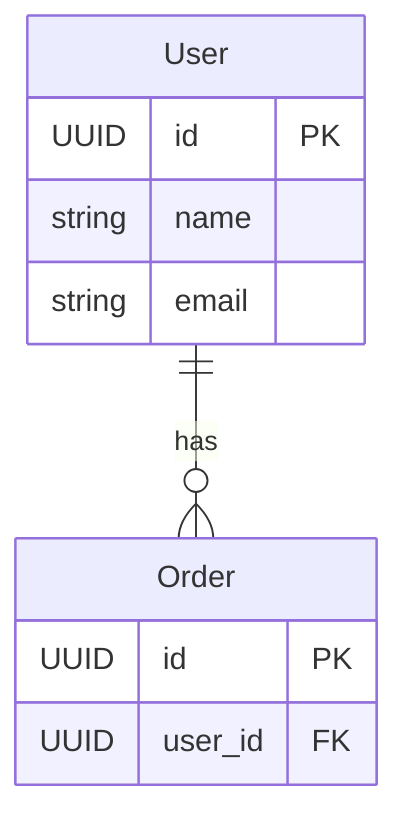

# ER図表示機能 - 段階的発展計画

## 概要

このドキュメントは、エンドユーザー向けER図表示機能の段階的な発展計画（Phase 1 → Phase 2 → Phase 3）を記録する。

**対象範囲:**
- データソース: `design_documents` テーブルの `type='model'`（業務ドメインモデル）
- 表示粒度: プロジェクト全体
- ページ: `/schema/er`

**非対象:**
- データベーステーブル定義のER図（`docs/design/database-schema-design.md` 参照）

---

## Phase 1: 静的ER図表示（✅ 実装済み）

### 目的
- プロジェクト全体のドメインモデルをER図として一覧表示
- エンティティ間の関連（1:1, 1:N, N:M）を矢印で可視化

### 実装内容

#### データ取得
- API Route: `/api/schema/er/er?projectId=xxx`
- Supabase経由で `design_documents` (type='model') を取得
- 変換ロジック: `/lib/utils/design-documents/model-to-mermaid.ts`

#### Mermaid変換ロジック

**relationships → 関連線:**
```typescript
"1:1"  → "||--||"
"1:N"  → "||--o{"
"N:1"  → "}o--||"
"N:M"  → "}o--o{"
```

**attributes → エンティティ定義:**


#### コンポーネント
- `/app/(with-sidebar)/schema/er/page.tsx` - メインページ
- `/components/schema/er/MermaidRenderer.tsx` - Mermaid描画
- サイドバーに「ER図（ドメインモデル）」リンク追加

#### 技術選定
- **Mermaid.js**: テキストベース、軽量（200KB gzip）、学習コスト低い
- **クライアントサイドレンダリング**: `mermaid.render()` でSVG生成

### 制約
- 静的表示のみ（ズーム・パンなし）
- エンティティクリックで詳細表示なし

---

## Phase 2: ズーム・パン機能（🔜 将来実装）

### 目的
- 大きなER図を見やすくする
- ユーザビリティ向上

### 実装方法

#### ライブラリ選定
- **react-zoom-pan-pinch**: 5KB gzip、軽量
- マウスホイールズーム、ドラッグ移動、ピンチ（モバイル）対応

#### コンポーネント追加

**SchemaViewer（新規）:**
```typescript
// components/schema/er/SchemaViewer.tsx
import { TransformWrapper, TransformComponent } from "react-zoom-pan-pinch";
import { MermaidRenderer } from "./MermaidRenderer";

export function SchemaViewer({ code }: { code: string }) {
  return (
    <TransformWrapper
      initialScale={1}
      minScale={0.5}
      maxScale={3}
      centerOnInit
    >
      <TransformComponent>
        <MermaidRenderer code={code} />
      </TransformComponent>
    </TransformWrapper>
  );
}
```

**ページ修正:**
```typescript
// app/(with-sidebar)/schema/er/page.tsx
- <MermaidRenderer code={mermaidCode} />
+ <SchemaViewer code={mermaidCode} />
```

### 既存コードの再利用
- `MermaidRenderer` はそのまま再利用
- Phase 1のロジックは一切変更不要

### 実装時間
- 1-2時間（ライブラリ追加、コンポーネント作成、動作確認）

### ユーザー操作
- **マウスホイール**: ズームイン・ズームアウト
- **ドラッグ**: ER図を移動
- **ピンチ（モバイル）**: タッチでズーム
- **リセットボタン**: 初期状態に戻る（オプション）

---

## Phase 3: エンティティクリックで詳細表示（🔜 将来実装）

### 目的
- エンティティ定義への素早いアクセス
- 属性・関連・状態遷移の詳細を確認

### 実装方法

#### SVG DOM操作

**クリックイベント追加:**
```typescript
// components/schema/er/MermaidRenderer.tsx に追加
useEffect(() => {
  const svg = containerRef.current?.querySelector("svg");
  if (!svg) return;

  const entityNodes = svg.querySelectorAll(".er-entityName");
  entityNodes.forEach((node) => {
    node.addEventListener("click", (e) => {
      const entityName = (e.target as HTMLElement).textContent;
      if (entityName) {
        onEntityClick(entityName); // コールバック関数
      }
    });
  });

  return () => {
    // クリーンアップ
    entityNodes.forEach((node) => {
      node.removeEventListener("click", () => {});
    });
  };
}, [mermaidCode]);
```

#### 詳細表示UI

**Option 1: モーダル（推奨）**
- `Dialog` コンポーネント（shadcn/ui）
- エンティティ名をタイトルに表示
- 既存の `ModelDetailViewer` を再利用

**Option 2: サイドパネル**
- 画面右側にスライドイン
- ER図とサイドパネルを同時表示

#### データ取得

**API追加:**
```typescript
// app/api/schema/er/entity/[entityName]/route.ts
export async function GET(
  request: Request,
  { params }: { params: { entityName: string } }
) {
  const { entityName } = params;
  const { searchParams } = new URL(request.url);
  const projectId = searchParams.get('projectId');

  // entityNameに一致するmodel型DDを取得
  const { data: dd } = await getDesignDocumentByEntityName(entityName, projectId);

  return NextResponse.json({ entity: dd.details.typeDetail });
}
```

**ページ側:**
```typescript
const [selectedEntity, setSelectedEntity] = useState<string | null>(null);
const [modalOpen, setModalOpen] = useState(false);

const handleEntityClick = async (entityName: string) => {
  const res = await fetch(`/api/schema/er/entity/${entityName}?projectId=${projectId}`);
  const { entity } = await res.json();
  setSelectedEntity(entity);
  setModalOpen(true);
};
```

#### 表示内容

**モーダル内容:**
1. **エンティティ基本情報**
   - 物理名（entityName）
   - 論理名（entityLogicalName）
   - 説明（entityDescription）

2. **属性テーブル**
   - 既存の `ModelDetailViewer` を再利用
   - カラム: 属性名、型、制約、説明

3. **関連リスト**
   - 関連種別（1:1, 1:N, N:1, N:M）バッジ
   - 関連先エンティティ
   - カラムマッピング（あれば）

4. **状態遷移**（あれば）
   - from → to の遷移図

### 既存コンポーネントの再利用
- `/components/system-domains/structured-spec-viewer/ModelDetailViewer.tsx`
- `@/components/ui/dialog` (shadcn/ui)

### 実装時間
- 2-3時間（API追加、クリックイベント、モーダルUI、動作確認）

---

## Phase 4: システム領域単位でのフィルタリング（🔜 将来実装）

### 目的
- 大規模プロジェクトでエンティティ数が多い場合の視認性向上
- システム領域（AR/AP/GL等）ごとにER図を絞り込み

### 実装方法

#### UI追加
```typescript
// app/(with-sidebar)/schema/er/page.tsx
<Select value={selectedDomain} onValueChange={setSelectedDomain}>
  <SelectItem value="all">全て</SelectItem>
  <SelectItem value="AR">売掛金管理（AR）</SelectItem>
  <SelectItem value="AP">買掛金管理（AP）</SelectItem>
  <SelectItem value="GL">総勘定元帳（GL）</SelectItem>
</Select>
```

#### フィルタリングロジック
```typescript
// lib/utils/design-documents/model-to-mermaid.ts
export function modelDDsToMermaidErDiagram(
  dds: DesignDocument[],
  domainFilter?: string
): string {
  let models = dds.filter(dd => dd.type === 'model');

  // システム領域でフィルタ（srfIdからドメインを抽出）
  if (domainFilter && domainFilter !== 'all') {
    models = models.filter(dd => dd.srf_id.startsWith(`SF-${domainFilter}`));
  }

  // 以降の変換ロジックは同じ
}
```

#### URL対応
- `/schema/er` - 全体表示
- `/schema/er?domain=AR` - AR領域のみ
- `/schema/er?domain=AP` - AP領域のみ

---

## Phase 5: 他の横串設計書（🔮 構想段階）

### 業務フロー図 (`/flow`)
- **データソース**: `business_tasks` テーブルの `process_steps`
- **ライブラリ**: Mermaid flowchart
- **表示内容**: 業務プロセスの流れ

### 画面遷移図 (`/screens`)
- **データソース**: screen型DDの `route`
- **ライブラリ**: Mermaid flowchart or React Flow
- **表示内容**: 画面間の遷移

### システム構成図 (`/architecture`)
- **データソース**: external_if型DD
- **ライブラリ**: Mermaid graph
- **表示内容**: 外部システムとの連携

---

## 技術選定の理由

### なぜ Mermaid を選んだか

| 理由 | 説明 |
|------|------|
| **テキストベース** | Git で差分管理しやすい、コードレビュー可能 |
| **軽量** | 200KB gzipped、ページ読み込み高速 |
| **学習コスト低い** | 既存の設計書（`database-schema-design.md`）でも使用 |
| **標準採用** | GitHub, GitLab, Notion などで標準サポート |
| **拡張性** | SVG出力なので後からJSで操作可能 |

### なぜデータベーステーブルではなくmodel型DDを使うか

| 理由 | 説明 |
|------|------|
| **エンドユーザー向け** | 業務ドメインモデルを表現するため |
| **論理vs物理の分離** | 論理エンティティ（業務視点）と物理テーブル（実装視点）は別物 |
| **論理名・説明が豊富** | `entityLogicalName`, `entityDescription` でドキュメントとして有用 |
| **既存のUI完備** | `ModelDetailViewer`, `DesignDocumentCard` で作成・表示が完成済み |

### React Flow ではなく Mermaid を Phase 1 で選んだ理由

| 項目 | Mermaid | React Flow |
|------|---------|-----------|
| **実装時間** | 1.5時間 | 1-2日 |
| **バンドルサイズ** | 200KB | 500KB |
| **学習コスト** | 低い | 中程度 |
| **カスタマイズ性** | 限定的 | 高い |
| **初期表示速度** | 速い | やや遅い |

**結論**: まずはMermaidで動くものを作り、Phase 2でズーム・パン追加、Phase 3で詳細表示追加という段階的アプローチが賢明。

---

## 参考リンク

- [Mermaid公式ドキュメント](https://mermaid.js.org/)
- [react-zoom-pan-pinch](https://www.npmjs.com/package/react-zoom-pan-pinch)
- [React Flow](https://reactflow.dev/)

---

## 更新履歴

| 日付 | Phase | 内容 |
|------|-------|------|
| 2026-02-09 | Plan | 本ドキュメント作成、Phase 1-5 の計画策定 |
| 2026-02-09 | Phase 1 | 実装完了。静的ER図表示機能をリリース |
