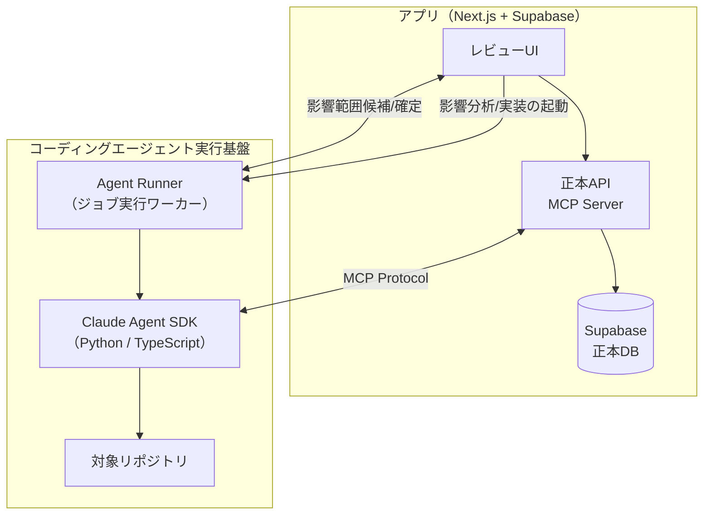
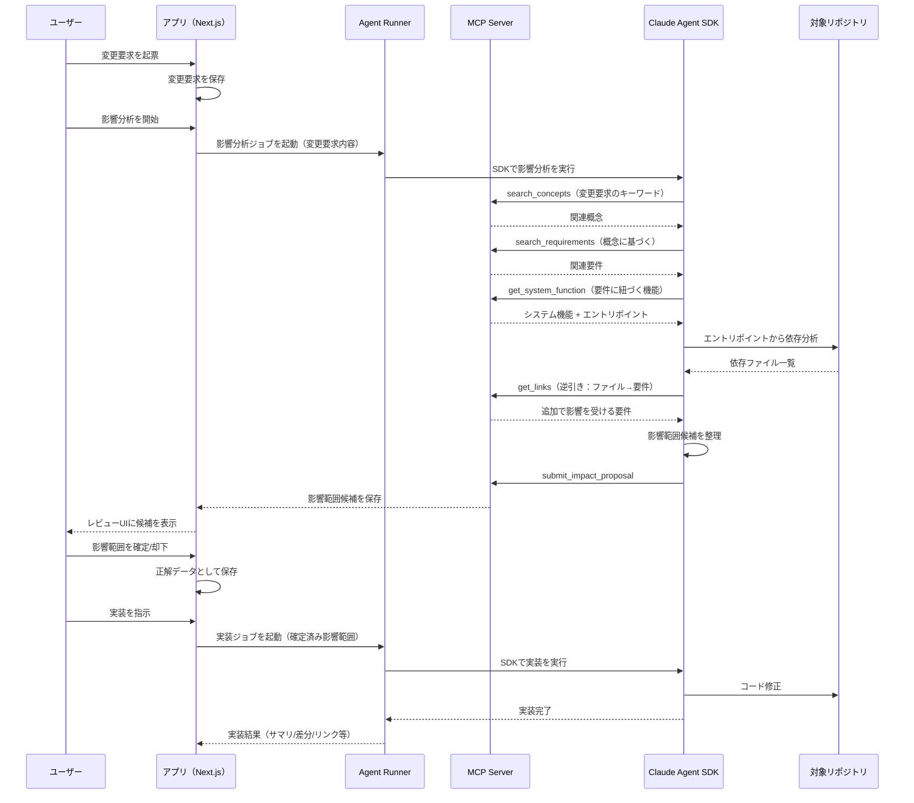
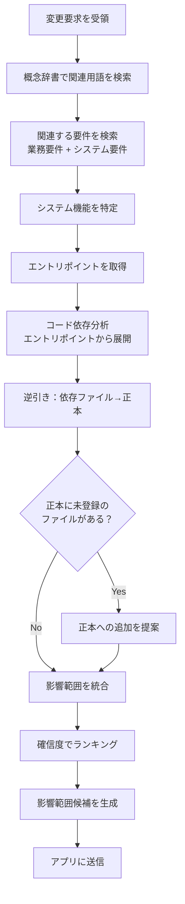
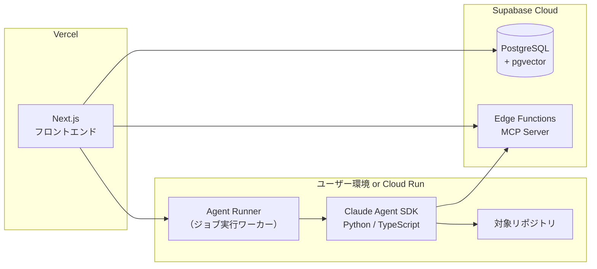

← 親ファイルの [PRD](../prd.md) の第6章に戻る。

---

# 6. 技術アーキテクチャ（ハイブリッド構成）

## 6.1 設計方針

本ツールは「正本の管理」と「レビュー/確定のUI」に集中し、影響調査のロジックはコーディングエージェントに委譲する。

この設計により以下を実現する。

- アプリ側のAI実装コストを大幅削減（LangGraph等の複雑なオーケストレーション不要）
- 影響調査→改修の文脈が一貫（ハンドオフによる情報損失がない）
- コーディングエージェントの進化がそのまま恩恵になる
- 構造化されたレビューUIと正解データ蓄積は維持

## 6.2 全体構成



| レイヤー | 責務 | 技術選定 |
|---------|------|---------|
| アプリ（フロントエンド） | 正本CRUD、レビューUI、確定データ保存 | Next.js（Vercel） |
| アプリ（バックエンド） | 正本API、MCP Server | Supabase Edge Functions or Next.js API Routes |
| 正本DB | 業務要件・システム要件・エントリポイント・正解データの保持 | Supabase（PostgreSQL + pgvector） |
| コーディングエージェント | 正本参照、影響調査、計画立案、実装 | Claude Agent SDK（Python / TypeScript） |
| Agent Runner | SDK実行の受付・ジョブ管理・結果返却 | ローカル常駐 or Cloud Run等 |

## 6.3 コンポーネントの役割

### 6.3.1 アプリ（Next.js + Supabase）

| コンポーネント | 役割 |
|---------------|------|
| 正本CRUD UI | 業務要件/システム要件/概念辞書/システム機能の登録・編集・削除 |
| レビューUI | 影響範囲候補の確認、確定、却下 |
| 正本API（MCP Server） | コーディングエージェントからの正本参照リクエストに応答 |
| 正解データ保存 | 人間が確定した影響範囲を正解データとして蓄積 |
| エクスポート | 5章形式での正本出力 |

### 6.3.2 コーディングエージェント（Claude Agent SDK）

| 責務 | 説明 |
|------|------|
| 正本参照 | MCP経由でアプリの正本DBにアクセスし、関連する要件・概念・エントリポイントを取得 |
| 影響調査 | 正本 + コード解析を組み合わせて影響範囲を特定 |
| 計画立案 | 影響範囲候補と根拠を構造化して提案 |
| 実装 | 確定済み影響範囲に基づいてコードを修正 |

### 6.3.3 Claude Agent SDK を採用する理由

| 選択肢 | 特徴 | 採用判断 |
|--------|------|---------|
| Claude Code（GUI/CLI） | 人間の対話操作を主用途とする。プロダクト組み込み時は「外部ツールとして起動」になりやすい | 不採用（MVPの自動化要件と相性が弱い） |
| Claude Agent SDK（Python / TypeScript） | エージェント実行ループとツール群をライブラリとして利用でき、アプリからジョブとして起動できる | 採用 |

Agent SDKを使うことで、アプリ側から影響調査を起動し、結果を構造化して受け取ることができる。

重要な注意点として、ブラウザから直接SDKを動かすのではなく、以下いずれかの「Agent Runner（実行基盤）」を介して起動する。

- ローカル常駐（ユーザーPC上のデーモン/CLIラッパーがジョブを受けてSDKを実行）
- クラウド常駐（Cloud Run等のジョブ実行基盤がSDKを実行）

※ 実装時点でのSDK成熟度・API仕様を確認し、必要に応じて代替手段（Claude API直接呼び出し + ツール実装）も検討する。

## 6.4 MCP Server の設計

アプリはMCP（Model Context Protocol）Serverとして正本へのアクセスを提供する。これによりコーディングエージェントから直接正本を参照できる。

### 6.4.1 提供するMCPツール

| ツール名 | 説明 | パラメータ |
|---------|------|-----------|
| `search_requirements` | 要件を検索（業務/システム） | `query: string`, `type?: "business" \| "system"` |
| `get_requirement` | 要件の詳細を取得 | `id: string` |
| `search_concepts` | 概念辞書を検索 | `query: string` |
| `get_concept` | 概念の詳細を取得 | `id: string` |
| `get_system_function` | システム機能（エントリポイント含む）を取得 | `id: string` |
| `list_system_functions_by_domain` | システム領域内の機能一覧 | `domain_id: string` |
| `get_links` | 要件間のリンクを取得 | `source_id: string` |
| `submit_impact_proposal` | 影響範囲候補をアプリに送信 | `proposal: ImpactProposal` |

### 6.4.2 ImpactProposal の構造

```typescript
interface ImpactProposal {
  change_request_id: string;
  affected_items: AffectedItem[];
  summary: string;
}

interface AffectedItem {
  id: string;
  type: "business_requirement" | "system_requirement" | "system_function" | "file";
  name: string;
  confidence: "high" | "medium" | "low";
  evidence: Evidence;
}

interface Evidence {
  matched_concepts: string[];
  source_references: string[];  // 引用元の要件ID等
  reason: string;               // なぜ影響があると判断したか
}
```

## 6.5 影響分析フロー

### 6.5.1 全体シーケンス



### 6.5.2 影響調査の詳細フロー



### 6.5.3 コード依存分析の委譲

コード依存グラフは自前で構築・維持せず、Agent SDKに委譲する。

| 観点 | 自前で依存グラフ構築 | Agent SDKに委譲 |
|------|---------------------|----------------------|
| 実装コスト | 高い（言語別パーサー） | 低い（指示を投げるだけ） |
| 維持コスト | 高い（グラフの陳腐化） | なし（毎回リアルタイム解析） |
| 精度 | 静的解析の限界 | LLMのコード理解でより正確 |
| 速度 | 高速（事前計算済） | 遅い（毎回解析） |

速度問題の対処：

- 深さ制限：最初は2階層まで、必要なら追加探索
- バックグラウンド実行：変更要求の起票時点で影響分析を開始
- 部分的キャッシュ：同一セッション内での重複クエリをキャッシュ

## 6.6 デプロイ構成



| コンポーネント | デプロイ先 | 備考 |
|---------------|-----------|------|
| Next.js フロントエンド | Vercel | UI + API Routes |
| MCP Server | Supabase Edge Functions | または Next.js API Routes |
| 正本DB | Supabase Cloud | PostgreSQL + pgvector |
| Agent Runner | ユーザーのローカル環境 or Cloud Run | ジョブ受付、実行、結果返却 |
| Agent SDK | Agent Runner と同居 | PythonランタイムまたはNode.jsランタイム |
| 対象リポジトリ | GitHub / ローカル | Agent SDKからclone/参照 |

### 6.6.1 Agent SDK の実行環境

Agent SDKの実行環境は2パターンを想定する。

| パターン | 説明 | 適用シーン |
|---------|------|-----------|
| ローカル実行 | ユーザーのPC上でAgent Runnerがジョブを受け、Agent SDKを実行 | 開発中、リポジトリがローカルにある場合 |
| クラウド実行 | Cloud Run等でAgent RunnerがAgent SDKを実行 | CI/CD連携、自動化 |

MVPではローカル実行を優先し、クラウド実行は将来拡張とする。

## 6.7 コスト・クォータの考慮

Agent SDKはAnthropic APIのトークンを消費する。

| 操作 | 想定トークン消費 | 頻度 |
|------|-----------------|------|
| 正本検索（1クエリ） | 500〜2,000 | 変更要求あたり5〜10回 |
| コード依存分析（1エントリポイント） | 3,000〜10,000 | 変更要求あたり3〜10回 |
| 影響範囲候補生成 | 2,000〜5,000 | 変更要求あたり1回 |
| 実装（1ファイル） | 5,000〜20,000 | 影響ファイル数に依存 |

変更要求1件あたりの総コストは、影響範囲の規模によるが、概算で50,000〜200,000トークン程度を想定。

### 6.7.1 コスト最適化の方針

- 段階的な深掘り：最初は浅い分析で候補を出し、ユーザーの指示で深掘り
- 正本の充実：正本が充実するほど、コード分析の範囲を絞れる
- キャッシュ活用：同一セッション内での重複クエリをキャッシュ

## 6.8 セキュリティ考慮

### 6.8.1 正本APIのアクセス制御

MCP Serverへのアクセスは、以下の方式で制御する。

| 方式 | 説明 | MVPでの採用 |
|------|------|------------|
| APIキー認証 | プロジェクトごとのAPIキーを発行 | ○（MVP） |
| OAuth連携 | ユーザー認証と連携 | 将来拡張 |
| IP制限 | 許可されたIPのみアクセス可 | 将来拡張 |

### 6.8.2 機密情報の取り扱い

Agent SDKに送信される情報は、正本の内容とコードの一部。顧客固有情報が含まれる可能性があるため、以下を考慮する。

- 送信対象の可視化：どの正本データがAgent SDKに送られるかをUIで表示
- 機密フラグ：機密性の高い要件には「Agent SDK送信不可」フラグを設定可能（将来拡張）
- Anthropicのデータポリシー確認：APIで送信されたデータの取り扱いを確認

## 6.9 将来拡張

| 拡張項目 | 説明 | 優先度 |
|---------|------|--------|
| 複数エージェント対応 | Claude以外のエージェント（GPT、Gemini等）への対応 | 低 |
| CI/CD連携 | PR作成時に自動で影響分析を実行 | 中 |
| 正解データによる精度改善 | 蓄積した正解データでプロンプトを改善 | 高 |
| MCP Server の公開 | 他のツールからも正本を参照可能に | 中 |