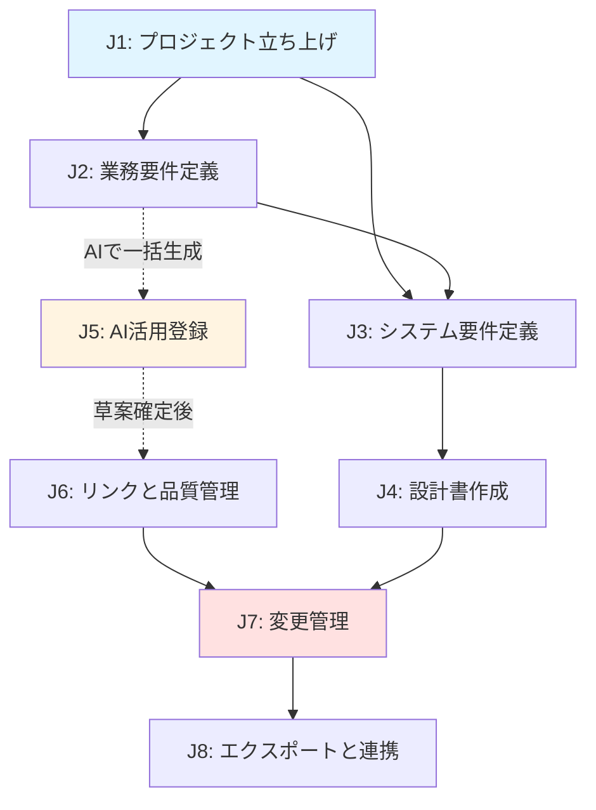

# ユーザーストーリー

> **目的**: 「ユーザーがなぜ・どう使いたいか」を体系的に記述し、UI/UXレビュー基準と開発方向性ガイドとして機能する
> **対象読者**: 開発者・UIレビュアー・AI
> **元ドキュメント**: `docs/PRD.md`（仕様書）の上位に位置づける

このドキュメントは、要件管理DBの「北極星」として、すべての画面・機能・操作がユーザー体験に沿っているかを確認するための基準を提供します。

---

## 1. ペルソナ定義

### 要件管理者（ソロ開発者）

**背景:**
- コーディングエージェント（Claude Code等）を活用して受託スクラッチ開発を行う
- PO帽（業務要件定義、変更判断）、SE帽（システム要件・DD）、AI運用帽（チャット、エクスポート）を使い分ける
- 1人で全工程を担当するため、時間効率と品質維持のバランスが重要

**コアニーズ:**
- 書き方を考える時間の最小化
- 影響見落とし防止
- 1人品質維持

**デバイス:**
- PC（開発環境：WSL）
- ブラウザ（Chrome推奨）

**スキルセット:**
- 基幹業務システムの知識（会計・販売・在庫等）
- TypeScript / React / Next.js の実装経験
- AIエージェントの活用経験（プロンプト設計）

---

## 2. ジャーニーマップ（概要）

**ジャーニーの依存関係:**
- J1（立ち上げ）は全ての起点
- J2（業務）とJ3（システム）は並行可能
- J5（AI活用）は手動登録（J2-J4）の代替パス
- J6（品質管理）は登録後の横断作業
- J7（変更管理）は運用フェーズ
- J8（エクスポート）はいつでも実行可能

---

## 3. ジャーニー別ユーザーストーリー

---

### J1: プロジェクトの立ち上げ

新規プロジェクト開始時の初期設定フェーズ。技術スタック・コーディング規約・業務/システム領域を定義する。

#### S1.1: プロジェクトを作成したい

**ストーリー:**
要件管理者として、新しいプロジェクトを作成したい。
なぜなら、複数の受託案件を並行管理し、プロジェクトごとに異なる技術スタックや業務領域を扱うから。

**前提状況:**
- 受託案件の基本情報（プロジェクト名、概要）が決まっている
- プロジェクト作成画面にアクセスできる

**期待するUX:**
- 必須項目は最小限（名前と説明のみ）で、すぐに作成できる
- 作成後、自動でPR設定画面に遷移して、続きを設定できる

**UXチェック基準:**

| # | 項目 | 優先度 | 実装状況 |
|---|------|--------|----------|
| 1 | プロジェクト作成フォームに必須項目（名前、説明）が明示されている | Must | ❌ |
| 2 | 「作成」ボタンクリック後、PR設定画面（/product-requirement/edit）に自動遷移する | Must | ❌ |
| 3 | 作成完了時にトーストで「プロジェクトを作成しました」と表示される | Should | ❌ |

**凡例:**
- **優先度**: Must（必須）/ Should（推奨）/ Nice（あれば良い）
- **実装状況**: ✅（完了）/ ❌（未着手）/ 🚧（進行中）

---

#### S1.2: プロダクト要件（PR）を設定したい

**ストーリー:**
要件管理者として、技術スタックとコーディング規約を最初に設定したい。
なぜなら、後続のAI生成（SF/SR/AC/DD）で一貫した技術選定と命名規則を適用してほしいから。

**前提状況:**
- プロジェクトが作成済み
- PR編集画面（/product-requirement/edit）にアクセスしている

**期待するUX:**
- タブ構成で項目が整理され、迷わず入力できる
- 技術スタックは未指定でもOK（agent_decidesとして扱われる）と明示される
- 保存後、次に何をすべきか（BD/SD作成）がガイドされる

**UXチェック基準:**

| # | 項目 | 優先度 | 実装状況 |
|---|------|--------|----------|
| 1 | 4つのタブ（基本情報／デザイン・UX／技術スタック／コーディング規約）が表示される | Must | ❌ |
| 2 | 技術スタックの各フィールドに「未指定の場合はAIが選択」と補足される | Must | ❌ |
| 3 | 保存ボタンクリック後、「次は業務領域とシステム領域を作成してください」とガイドが表示される | Should | ❌ |

---

#### S1.3: 業務領域とシステム領域を定義したい

**ストーリー:**
要件管理者として、業務の大分類（BD）とシステムの大分類（SD）を最初に定義したい。
なぜなら、後続の業務タスク（BT）やシステム機能（SF）を適切にグルーピングしたいから。

**前提状況:**
- PRが設定済み
- 業務一覧（/business）またはシステム領域一覧（/system）にアクセスしている

**期待するUX:**
- 業務領域とシステム領域の違いが分かりやすい（説明文で理解できる）
- 空状態で「業務領域がありません。追加してください」とガイドされる
- 作成後、配下のBT/SF追加に自然に進める

**UXチェック基準:**

| # | 項目 | 優先度 | 実装状況 |
|---|------|--------|----------|
| 1 | 空状態で説明文とアクションボタン（[追加]）が表示される | Must | ❌ |
| 2 | 業務領域作成フォームで「業務の大分類（例：請求、販売、在庫）」と例示される | Should | ❌ |
| 3 | システム領域作成フォームで「システムの大分類（例：財務会計、販売管理）」と例示される | Should | ❌ |
| 4 | 作成後、BD詳細画面（/business/[id]）またはSD詳細画面（/system/[id]）に自動遷移する | Must | ❌ |

---

### J2: 業務要件の定義（BT/BR）

業務タスク（BT）と業務要件（BR）を手動登録するフェーズ。「いつ誰が何をするか」と「何を達成したいか」を記述する。

#### S2.1: 業務タスク（BT）を登録したい

**ストーリー:**
要件管理者として、業務プロセスを業務タスク（BT）として登録したい。
なぜなら、「いつ誰が何をするか」を記録し、後続のシステム要件（SF/SR）の起点にしたいから。

**前提状況:**
- 業務領域（BD）が作成済み
- BD詳細画面（/business/[id]）で「手動で追加」をクリックしている

**期待するUX:**
- 必須項目（名前、概要）と推奨項目（業務コンテキスト、プロセスステップ）が明確に区別される
- 入力中に「AIで追加」という別の選択肢があることが分かる（「書くのが面倒ならAIで」と提案される）
- 保存後、BT詳細画面に遷移し、BR追加に進める

**UXチェック基準:**

| # | 項目 | 優先度 | 実装状況 |
|---|------|--------|----------|
| 1 | フォームの必須項目に「*」マークと「必須」ラベルが付いている | Must | ❌ |
| 2 | 「概要」フィールドに「業務の目的と流れを200字程度で記述」とプレースホルダーがある | Must | ❌ |
| 3 | 保存ボタンの近くに「AIで追加する」リンクが表示される | Should | ❌ |
| 4 | 保存後、BT詳細画面（/business/[id]/[taskId]）に遷移し、「業務要件を追加してください」とガイドされる | Must | ❌ |

---

#### S2.2: 業務要件（BR）を登録したい

**ストーリー:**
要件管理者として、業務タスクで達成したいことを業務要件（BR）として登録したい。
なぜなら、「～できること」というケイパビリティとその制約を明確にし、システム機能との紐付け（realizes）の起点にしたいから。

**前提状況:**
- 業務タスク（BT）が作成済み
- BT詳細画面（/business/[id]/[taskId]）で「手動で追加」をクリックしている

**期待するUX:**
- 要件名は「～できること」形式で記述するようガイドされる
- 制約は箇条書きで記述でき、複数の制約を分けて管理できる
- 保存後、「実現するシステム機能」セクションで既存SFとのリンクを追加できる

**UXチェック基準:**

| # | 項目 | 優先度 | 実装状況 |
|---|------|--------|----------|
| 1 | 要件名フィールドに「例：請求書をPDFで出力できる」とプレースホルダーがある | Must | ❌ |
| 2 | 要件詳細（rationale）フィールドに「達成したい業務成果と、その測り方を100〜200字で」と説明がある | Should | ❌ |
| 3 | 保存後、BT詳細画面に戻り、作成したBRがカードで表示される | Must | ❌ |
| 4 | BRカード内に「実現するシステム機能: 未リンク [リンク追加]」と表示される | Must | ❌ |

---

#### S2.3: BRとSFのrealizesリンクを作成したい

**ストーリー:**
要件管理者として、業務要件（BR）を実現するシステム機能（SF）をリンクしたい。
なぜなら、業務要件の変更時にどのシステム機能が影響を受けるかを追跡したいから。

**前提状況:**
- BRが作成済み
- SFが既に作成されている（または新規作成する）

**期待するUX:**
- BRカードから「リンク追加」をクリックすると、SFを検索・選択できる
- 既存SFがない場合、「新規SFを作成」で作成しつつリンクできる
- リンク後、BRカードに「実現するシステム機能: SF-BIL-010」と表示される

**UXチェック基準:**

| # | 項目 | 優先度 | 実装状況 |
|---|------|--------|----------|
| 1 | 「リンク追加」ボタンをクリックすると、SF検索ダイアログが開く | Must | ❌ |
| 2 | 検索ダイアログで「新規SFを作成」ボタンが表示される | Should | ❌ |
| 3 | SF選択後、即座にBRカードに反映され、リンク成功のトーストが表示される | Must | ❌ |
| 4 | リンクしたSF名をクリックすると、SF詳細画面（/system/[id]/[srfId]）に遷移する | Must | ❌ |

---

### J3: システム要件の定義（SF/SR/AC）

システム機能（SF）、システム要件（SR）、受入基準（AC）を手動登録するフェーズ。業務要件を実現するための技術仕様を定義する。

#### S3.1: システム機能（SF）を登録したい

**ストーリー:**
要件管理者として、業務要件を実現するシステム機能（SF）を登録したい。
なぜなら、SR（システム要件）とDD（設計書）を束ねる箱として、機能単位で仕様を管理したいから。

**前提状況:**
- システム領域（SD）が作成済み
- SD詳細画面（/system/[id]）で「追加」をクリックしている

**期待するUX:**
- 機能名と概要（description）を入力すれば作成できる
- 作成後、SF詳細画面に遷移し、SR/DD追加に自然に進める
- BRとのrealizesリンクは後で追加できる（または作成時に選択できる）

**UXチェック基準:**

| # | 項目 | 優先度 | 実装状況 |
|---|------|--------|----------|
| 1 | フォームの必須項目（機能名、概要）が明示される | Must | ❌ |
| 2 | 「概要」フィールドに「誰に対して何を提供するか、200字程度で」とプレースホルダーがある | Must | ❌ |
| 3 | 保存後、SF詳細画面（/system/[id]/[srfId]）に遷移し、「システム要件を追加してください」とガイドされる | Must | ❌ |

---

#### S3.2: システム要件（SR）を登録し、type別のGWTテンプレートを使いたい

**ストーリー:**
要件管理者として、システム要件（SR）を登録する際、type（観点種別）に応じたGWTテンプレートを使いたい。
なぜなら、機能/データ/例外/非機能の観点で異なる受入基準（AC）を書く必要があり、テンプレートがあると迷わず書けるから。

**前提状況:**
- システム機能（SF）が作成済み
- SF詳細画面（/system/[id]/[srfId]）で「SR追加」をクリックしている

**期待するUX:**
- type選択（functional/data/exception/non-functional）に応じて、ACの推奨テンプレートが表示される
- 例示が豊富で、どう書けばいいか迷わない
- 保存後、SR一覧に追加され、ACを追加できる

**UXチェック基準:**

| # | 項目 | 優先度 | 実装状況 |
|---|------|--------|----------|
| 1 | type選択ドロップダウンが表示され、各typeの説明（例：functional=機能、data=データ整合性）が表示される | Must | ❌ |
| 2 | type選択後、「このtypeの場合、ACはこう書きます」と例文が表示される | Should | ❌ |
| 3 | 保存後、SR一覧に追加され、「受入基準を追加してください」とガイドされる | Must | ❌ |

---

#### S3.3: 受入基準（AC）をGWT形式で登録したい

**ストーリー:**
要件管理者として、受入基準（AC）をGiven-When-Then（GWT）形式で登録したい。
なぜなら、検証可能な条件を明確に記述し、後続のテスト生成やPRレビューの基準にしたいから。

**前提状況:**
- システム要件（SR）が作成済み
- SR詳細セクションで「AC追加」をクリックしている

**期待するUX:**
- GWT形式のフォームが表示され、各セクション（Given/When/Then）に何を書くべきか明示される
- 曖昧な表現（「適切に」「正しく」等）を入力すると警告される
- 保存後、SR内のAC一覧に追加される

**UXチェック基準:**

| # | 項目 | 優先度 | 実装状況 |
|---|------|--------|----------|
| 1 | フォームに「Given」「When」「Then」の3セクションが明確に分かれている | Must | ❌ |
| 2 | 各セクションに例文プレースホルダーがある（例：Given「受注ステータスが『確定』」） | Must | ❌ |
| 3 | 曖昧表現を入力すると、リアルタイムで「検証可能な表現にしてください」と警告される | Should | ❌ |
| 4 | 保存後、SR詳細セクションのAC一覧に「AC-001: シナリオ名」とカード表示される | Must | ❌ |

---

### J4: 設計書の作成（DD）

DD（Design Document）を手動登録するフェーズ。画面/API/バッチ等の実装形態ごとに、entry_pointと設計詳細を定義する。

#### S4.1: DDを登録し、typeを選択したい

**ストーリー:**
要件管理者として、DD（Design Document）を登録する際、type（screen/api/batch/job/external_if/model/report）を選択したい。
なぜなら、typeに応じた入出力スキーマと設計項目が異なるため、適切なフォームで入力したいから。

**前提状況:**
- システム機能（SF）が作成済み
- SF詳細画面（/system/[id]/[srfId]）で「DD追加」をクリックしている

**期待するUX:**
- type選択後、そのtypeに特化したフォームが表示される
- 例：apiを選択 → method/pathが必須、screenを選択 → routeが必須
- 各typeの違いが分かりやすい（アイコンと説明文で）

**UXチェック基準:**

| # | 項目 | 優先度 | 実装状況 |
|---|------|--------|----------|
| 1 | type選択ドロップダウンに各typeのアイコンと説明が表示される（例：screen 「画面」 📱） | Must | ❌ |
| 2 | type選択後、専用フォーム（入力スキーマ、出力スキーマ、エントリポイント）が表示される | Must | ❌ |
| 3 | 保存後、DD一覧にtypeアイコン付きでカード表示される | Should | ❌ |

---

#### S4.2: 構造化入出力スキーマを定義したい

**ストーリー:**
要件管理者として、DDの入出力をフィールド単位で構造化して定義したい。
なぜなら、フィールド名・型・必須/任意・制約を明確にし、コーディングエージェントへの指示精度を上げたいから。

**前提状況:**
- DD作成フォームでtypeを選択済み
- 「入力スキーマ」セクションを編集している

**期待するUX:**
- フィールド追加ボタンで、1フィールドずつ定義できる
- 型（string/number/boolean/enum/object/array）を選択すると、制約フィールドが動的に変わる
- 例：stringを選択 → min/max/pattern、enumを選択 → 列挙値入力

**UXチェック基準:**

| # | 項目 | 優先度 | 実装状況 |
|---|------|--------|----------|
| 1 | 「フィールド追加」ボタンをクリックすると、新しいフィールド行が追加される | Must | ❌ |
| 2 | 型選択ドロップダウンで型を変更すると、制約フィールドが動的に表示される | Must | ❌ |
| 3 | 制約に「pattern（正規表現）」を入力すると、リアルタイムで妥当性チェックされる | Nice | ❌ |
| 4 | 保存後、DD詳細画面で「入力スキーマ: 3フィールド」と表示される | Should | ❌ |

---

#### S4.3: エントリポイントを登録したい

**ストーリー:**
要件管理者として、DDのentry_point（ファイルパス）を登録したい。
なぜなら、影響調査でこのパスを起点にコード依存関係を解析するため、正確なパスを指定したいから。

**前提状況:**
- DD作成フォームでbasic情報を入力済み
- 「エントリポイント」セクションを編集している

**期待するUX:**
- ファイルパスを入力すると、プロジェクトのcoding_conventions（directory_structure）に沿っているか確認される
- 複数のentry_pointを登録できる（画面の場合、page.tsx + API routeなど）
- 共通処理（src/utils/）はentry_pointに登録しないようガイドされる

**UXチェック基準:**

| # | 項目 | 優先度 | 実装状況 |
|---|------|--------|----------|
| 1 | entry_point入力フィールドに「例：src/features/billing/pages/InvoicePage.tsx」とプレースホルダーがある | Must | ❌ |
| 2 | 共通処理パス（src/utils/、src/libs/）を入力すると、「共通処理は登録しないでください」と警告される | Should | ❌ |
| 3 | 保存後、DD詳細画面で「エントリポイント: src/features/...」と表示される | Must | ❌ |

---

#### S4.4: コアロジックと保存/通知（sideEffects）を分けて記述したい

**ストーリー:**
要件管理者として、DDのコアロジック（純粋なビジネスロジック）と保存/通知（外部状態変更）を分けて記述したい。
なぜなら、インメモリ処理（計算・判定）と外部影響（DB/API）を明確に区別し、影響範囲を正確に伝えたいから。

**前提状況:**
- DD作成フォームで入出力スキーマを定義済み
- 「コアロジック」「保存/通知」セクションを編集している

**期待するUX:**
- コアロジックは4つのタイプ（validate/read/derive/decide）で分類され、タイプ選択で入力項目が変わる
- 保存/通知は4つのカテゴリ（DB操作/外部API/イベント/ファイル出力）で分類され、カテゴリごとにフォームが表示される
- 「このDDが直接実行する操作のみ記載」とガイドされる

**UXチェック基準:**

| # | 項目 | 優先度 | 実装状況 |
|---|------|--------|----------|
| 1 | コアロジックのルール追加時、type選択（validate/read/derive/decide）が表示される | Must | ❌ |
| 2 | 保存/通知セクションで「DB操作」「外部API」「イベント」「ファイル出力」のタブが表示される | Must | ❌ |
| 3 | DB操作タブで「table」「operation」「affectedColumns」フィールドが表示される | Must | ❌ |
| 4 | 保存後、DD詳細画面で「コアロジック: 3ルール、保存/通知: DB操作 2件」と表示される | Should | ❌ |

---

### J5: AIを活用した要件登録

AIチャットUIで自然文から草案を生成し、レビュー・確定するフェーズ。手動登録の代替パス。

#### S5.1: AIチャットを起動し、コンテキストが自動注入されることを確認したい

**ストーリー:**
要件管理者として、AIチャットを起動した際、現在のコンテキスト（BD/BT等）が自動注入されることを確認したい。
なぜなら、毎回「Next.jsで開発している」「請求領域の話をしている」と説明するのは面倒だから。

**前提状況:**
- 業務領域詳細画面（/business/[id]）で「AIで追加」をクリックしている

**期待するUX:**
- チャットUI開始時に「コンテキスト: BD-BIL（請求）」と表示される
- 最初のシステムメッセージで「この業務領域に業務タスクを追加します」とガイドされる
- PRの技術スタックが自動参照される（ユーザーが説明不要）

**UXチェック基準:**

| # | 項目 | 優先度 | 実装状況 |
|---|------|--------|----------|
| 1 | チャットUI上部に「コンテキスト: BD-BIL（請求）」と表示される | Must | ❌ |
| 2 | 最初のメッセージがシステムから自動表示される（例：「どのような業務を登録しますか？」） | Must | ❌ |
- [ ] PRのtech_stack_profileがコンテキストに含まれていることが確認できる（ユーザーに明示する必要はない）

---

#### S5.2: 自然文からBT/BR草案を生成し、プレビューしたい

**ストーリー:**
要件管理者として、自然文で業務を説明すると、BT/BR草案が生成され、プレビューしたい。
なぜなら、フォームで1項目ずつ入力するより速く、草案を見ながら修正できるから。

**前提状況:**
- AIチャットUIでコンテキストが注入済み
- 「請求書を発行してメールで送る業務を追加したい」と入力している

**期待するUX:**
- 草案生成中はストリーミング表示（文字が徐々に表示）される
- 草案プレビューカードがチャット内に埋め込まれ、主要情報（BT名、BR名）が表示される
- 「詳細を見る」「確定」「編集」ボタンが明示される

**UXチェック基準:**

| # | 項目 | 優先度 | 実装状況 |
|---|------|--------|----------|
| 1 | メッセージ入力後、「草案を生成中...」とローディング表示される | Must | ❌ |
| 2 | 草案プレビューカードに「BT-BIL-002: 請求書発行・送付」「BR: 2件」と表示される | Must | ❌ |
| 3 | 「詳細を見る」ボタンをクリックすると、モーダルで全フィールドが表示される | Should | ❌ |
| 4 | 「確定」ボタンをクリックすると、「正本に登録しました」とトーストが表示される | Must | ❌ |

---

#### S5.2.1: 議事録から複数BT/BR草案を一括生成したい

**ストーリー:**
要件管理者として、議事録やヒアリングメモを貼り付けるだけで、複数のBT/BR草案を一括生成したい。
なぜなら、議事録の内容を1件ずつ手で分解して登録するのは手間で、抜け漏れが起きやすいから。

**前提状況:**
- AIチャット画面（/chat）を開いている
- 業務領域（BD）が事前に作成されている

**期待するUX:**
- チャットヘッダーに「議事録から草案」ボタンがあり、クリックでモーダルが開く
- 議事録テキストを貼り付けて「抽出」すると、BT候補の一覧が表示される
- 候補ごとに業務領域（BD）を割り当てでき、割り当て後に「草案を生成」で複数のBT/BR草案カードがチャットに追加される
- 確定は従来と同じく、草案カード単位で行う（バッチ確定はしない）

**UXチェック基準:**

| # | 項目 | 優先度 | 実装状況 |
|---|------|--------|----------|
| 1 | /chat ヘッダーに「議事録から草案」ボタンが表示される | Must | ❌ |
| 2 | 抽出結果（候補一覧）にチェックボックスとBD割当UIがある | Must | ❌ |
| 3 | BD未割当の候補がある場合、「草案を生成」が実行できずエラーが表示される | Must | ❌ |
| 4 | 草案生成後、BT/BR草案カードが候補数ぶん表示される | Must | ❌ |

---

#### S5.3: SF/SR/ACを一括生成し、個別に確認・確定したい

**ストーリー:**
要件管理者として、BRからSF/SR/ACを一括生成し、1つずつ確認してから確定したい。
なぜなら、すべてを盲目的に確定するのではなく、内容を確認して修正したいから。

**前提状況:**
- AIチャットUIでBT/BRが確定済み
- 「この業務に対してSF/SR/ACを作って」と入力している

**期待するUX:**
- 草案プレビューに「全て確定」「個別に確認」ボタンが表示される
- 「個別に確認」を選ぶと、1つずつ確認画面が表示される
- 各確認画面で「確定」「編集」「スキップ」を選択できる

**UXチェック基準:**

| # | 項目 | 優先度 | 実装状況 |
|---|------|--------|----------|
| 1 | 草案プレビューに「全て確定」「個別に確認」ボタンが表示される | Must | ❌ |
| 2 | 「個別に確認」をクリックすると、「まずSF-BIL-020について」と1つ目の草案詳細が表示される | Must | ❌ |
| 3 | 各草案で「確定」「編集」「スキップ」ボタンが表示される | Must | ❌ |
| 4 | すべて確定後、「3件の要件を登録しました」とトーストが表示される | Must | ❌ |

---

#### S5.4: 品質チェック（critic_check）を実行し、修正提案を受け取りたい

**ストーリー:**
要件管理者として、草案確定前に品質チェック（critic_check）を実行し、曖昧な表現や矛盾を検出したい。
なぜなら、1人で作業しているため、第三者レビューの代わりにAIチェックで品質を担保したいから。

**前提状況:**
- AIチャットUIで草案が生成済み
- 「品質チェックして」と入力している

**期待するUX:**
- 検出された問題が致命度別（critical/warning/info）に表示される
- 各問題に対する修正案が提示される
- 修正案を採用すると、草案が自動更新される

**UXチェック基準:**

| # | 項目 | 優先度 | 実装状況 |
|---|------|--------|----------|
| 1 | チェック結果が「⚠️ 1件の警告があります」と表示される | Must | ❌ |
| 2 | 警告詳細に「AC-BIL-020-02の『エラー時』の定義が曖昧です」と表示される | Must | ❌ |
| 3 | 修正案に「『メール送信失敗時』に修正することを推奨」と表示される | Should | ❌ |
| 4 | 「修正案を適用」ボタンをクリックすると、草案が更新される | Must | ❌ |

---

### J6: 要件間リンクと品質管理

realizesリンクの作成、概念辞書の管理、ヘルススコアの確認を行うフェーズ。

#### S6.1: 未リンクのBRを検出し、SFとリンクしたい

**ストーリー:**
要件管理者として、BRとSFのrealizesリンクが未作成の状態を検出し、リンクを追加したい。
なぜなら、未リンクのBRがあると影響調査の精度が低下するため、早期にリンクを完成させたいから。

**前提状況:**
- ダッシュボードでヘルススコアを確認している
- 「未リンクのBR: 5件」と表示されている

**期待するUX:**
- ヘルススコアカードの「未リンクのBR」をクリックすると、該当BR一覧にフィルタ遷移する
- 各BRから「リンク追加」ボタンで既存SFを選択、またはSF新規作成できる
- リンク完了後、ヘルススコアが自動更新される

**UXチェック基準:**

| # | 項目 | 優先度 | 実装状況 |
|---|------|--------|----------|
| 1 | ヘルススコアカードで「未リンクのBR: 5件」がクリック可能なリンクになっている | Must | ❌ |
| 2 | クリック後、BT詳細画面の「未リンク」BRのみフィルタ表示される | Must | ❌ |
| 3 | リンク追加後、ヘルススコアが「未リンクのBR: 4件」に減る | Must | ❌ |

---

#### S6.2: 概念候補を承認・保留・却下したい

**ストーリー:**
要件管理者として、BT/BR登録時に提案された概念候補を承認・保留・却下したい。
なぜなら、概念辞書を育てることで、後続の要件登録時に用語が統一され、影響調査の精度が上がるから。

**前提状況:**
- BT作成フォームで保存ボタンをクリックしている
- 画面下部に「概念候補」セクションが表示されている

**期待するUX:**
- 候補ごとに「承認」「保留」「却下」ボタンが表示される
- 承認すると、概念辞書に自動登録され、BTのconcept_idsにリンクされる
- 保留すると、概念一覧の「未処理」タブに表示される

**UXチェック基準:**

| # | 項目 | 優先度 | 実装状況 |
|---|------|--------|----------|
| 1 | 概念候補セクションに「請求書 → 既存概念『請求書（Invoice）』と一致」と表示される | Must | ❌ |
| 2 | 「承認」ボタンをクリックすると、「概念をリンクしました」とトーストが表示される | Must | ❌ |
| 3 | 「保留」ボタンをクリックすると、概念一覧の「未処理」タブに追加される | Should | ❌ |
| 4 | 「却下」ボタンをクリックすると、今後この語句では提案されない | Nice | ❌ |

---

#### S6.3: ヘルススコアで正本の品質を俯瞰したい

**ストーリー:**
要件管理者として、ヘルススコアでプロジェクト全体の正本の品質を俯瞰したい。
なぜなら、どの部分が不完全か（未リンク、未設定、疑義リンク）を一目で把握し、優先度付けしたいから。

**前提状況:**
- ダッシュボード画面にアクセスしている

**期待するUX:**
- スコアが数値（0-100）とプログレスバーで表示される
- 「構造的なつながり」「データ品質」がサブカテゴリで分かれている
- 課題をクリックすると、該当する一覧画面にフィルタ遷移する

**UXチェック基準:**

| # | 項目 | 優先度 | 実装状況 |
|---|------|--------|----------|
| 1 | ダッシュボードに「全体スコア: 78%」と表示される | Must | ❌ |
| 2 | 「構造的なつながり: 82%」「データ品質: 74%」とサブカテゴリが表示される | Should | ❌ |
| 3 | 「⚠️ 未リンクの業務要件: 5件」をクリックすると、BR一覧にフィルタ遷移する | Must | ❌ |
| 4 | スコアが閾値（例：50%）を下回ると、警告アイコンと「影響分析の精度が低下する可能性があります」と表示される | Should | ❌ |

---

### J7: 変更管理（CR/影響調査）

運用フェーズで変更要求（CR）を起票し、影響調査を実行し、疑義リンクを解消するフェーズ。

#### S7.1: 変更要求（CR）を起票したい

**ストーリー:**
要件管理者として、機能追加や仕様変更を変更要求（CR）として起票したい。
なぜなら、変更の意図と影響範囲を記録し、影響調査の起点にしたいから。

**前提状況:**
- 変更要求一覧（/tickets）にアクセスしている
- 「起票」ボタンをクリックしている

**期待するUX:**
- タイトルと説明を入力すれば起票できる
- 初期スコープ（affected_scope）は任意で、後で影響調査で特定される
- 起票後、CR詳細画面に遷移し、「影響調査を開始してください」とガイドされる

**UXチェック基準:**

| # | 項目 | 優先度 | 実装状況 |
|---|------|--------|----------|
| 1 | フォームに必須項目（タイトル、説明）が明示される | Must | ❌ |
| 2 | 「初期スコープ」フィールドに「影響を受けそうな要件ID（任意）」と説明がある | Should | ❌ |
| 3 | 保存後、CR詳細画面（/tickets/[id]）に遷移し、status=draft、「影響調査を開始」ボタンが表示される | Must | ❌ |

---

#### S7.2: 影響調査を実行し、トップダウン結果を確認したい

**ストーリー:**
要件管理者として、CRに対して影響調査を実行し、トップダウン分析（正本ベース）の結果を確認したい。
なぜなら、変更がどの業務要件・システム機能・設計書に影響するかを把握したいから。

**前提状況:**
- CR詳細画面（/tickets/[id]）で「影響調査を開始」ボタンをクリックしている

**期待するUX:**
- ボタンクリック後、status=investigatingに変わり、プログレスバーが表示される
- トップダウン分析が完了すると、「影響調査」タブに結果が表示される
- 影響範囲が階層的に表示される（BR → SF → SR → AC → DD）

**UXチェック基準:**

| # | 項目 | 優先度 | 実装状況 |
|---|------|--------|----------|
| 1 | 「影響調査を開始」ボタンクリック後、「調査中...」とプログレスバーが表示される | Must | ❌ |
| 2 | 調査完了後、「影響調査」タブに「トップダウン分析（正本ベース）」セクションが表示される | Must | ❌ |
| 3 | トップダウン結果が「BR-BIL-001 → SF-BIL-010 → SR-BIL-001 → DD-BIL-010-01」と階層表示される | Must | ❌ |
| 4 | 各要件IDをクリックすると、該当詳細画面に遷移する | Should | ❌ |

---

#### S7.3: 疑義リンクを解消したい

**ストーリー:**
要件管理者として、影響調査で検出された疑義リンク（suspect=true）を解消したい。
なぜなら、疑義リンクが残っていると改修指示パッケージを生成できず、改修に進めないから。

**前提状況:**
- CR詳細画面の「疑義リンク」タブにアクセスしている
- 「🔴 high: BR-BIL-001 → SF-BIL-010」と表示されている

**期待するUX:**
- 疑義理由が明示される（例：「SFの範囲がBRの要求を満たしていない可能性」）
- 「確認して維持」または「修正」ボタンが表示される
- 「確認して維持」をクリックすると、suspect=falseになり、リストから消える

**UXチェック基準:**

| # | 項目 | 優先度 | 実装状況 |
|---|------|--------|----------|
| 1 | 疑義リンクが重大度（high/medium/low）別に色分けされている（high=赤、medium=黄、low=青） | Must | ❌ |
| 2 | 各疑義に「reason: SFの範囲がBRの要求を満たしていない可能性」と表示される | Must | ❌ |
| 3 | 「確認して維持」ボタンをクリックすると、「疑義を解消しました」とトーストが表示される | Must | ❌ |
| 4 | high/mediumの疑義が閾値以下（例：0件）になると、「改修指示パッケージ生成」ボタンが有効になる | Must | ❌ |

---

#### S7.4: 改修指示パッケージを生成し、内容を確認したい

**ストーリー:**
要件管理者として、疑義解消後に改修指示パッケージを生成し、内容を確認したい。
なぜなら、allow_paths（変更許可パス）が適切か、参照要件が過不足ないかを確認してから改修に進みたいから。

**前提状況:**
- CR詳細画面で疑義リンクを解消済み
- 「改修指示パッケージ生成」ボタンが有効になっている

**期待するUX:**
- ボタンクリック後、パッケージ内容がプレビュー表示される
- allow_paths、参照要件ID、残存リスクが確認できる
- 「このパッケージで改修を実行」ボタンをクリックすると、コーディングエージェントにジョブが投入される

**UXチェック基準:**

| # | 項目 | 優先度 | 実装状況 |
|---|------|--------|----------|
| 1 | 「改修指示パッケージ生成」ボタンをクリックすると、「生成中...」とローディング表示される | Must | ❌ |
| 2 | 生成後、「改修指示」タブにパッケージ内容が表示される | Must | ❌ |
| 3 | allow_paths一覧（例：「src/features/billing/pages/InvoicePage.tsx」）が表示される | Must | ❌ |
| 4 | 「このパッケージで改修を実行」ボタンをクリックすると、「改修ジョブを投入しました」とトーストが表示される | Must | ❌ |

---

### J8: エクスポートと外部連携

要件ドキュメントをエクスポートし、Claude Codeや他ツールに連携するフェーズ。

#### S8.1: 要件ドキュメントをエクスポートしたい

**ストーリー:**
要件管理者として、プロジェクトの要件ドキュメントをMarkdown形式でエクスポートしたい。
なぜなら、Claude Codeに読み込ませて、コーディングエージェントに正本を参照させたいから。

**前提状況:**
- エクスポート画面（/export）にアクセスしている

**期待するUX:**
- 形式（business/requirements/system/graph）を選択すると、出力内容のプレビューが表示される
- 「エクスポート実行」ボタンでZIPファイルがダウンロードされる
- エクスポート完了後、「ダウンロードが開始されました」とトーストが表示される

**UXチェック基準:**

| # | 項目 | 優先度 | 実装状況 |
|---|------|--------|----------|
| 1 | 形式選択ドロップダウンに「業務要件（business）」「システム要件（requirements）」等が表示される | Must | ❌ |
| 2 | 形式選択後、「出力されるファイル: business/BD-BIL/BT-BIL-001.md」とプレビューが表示される | Should | ❌ |
| 3 | 「エクスポート実行」ボタンをクリックすると、ZIPファイルがダウンロードされる | Must | ❌ |
| 4 | ダウンロード後、「エクスポートが完了しました」とトーストが表示される | Should | ❌ |

---

#### S8.2: エクスポートしたドキュメントをClaude Codeで参照できることを確認したい

**ストーリー:**
要件管理者として、エクスポートしたドキュメントをClaude Codeが正しく読み取れることを確認したい。
なぜなら、フォーマットが正しくないとClaude Codeが要件を理解できず、改修精度が低下するから。

**前提状況:**
- エクスポートしたZIPファイルを解凍し、Claude Codeのプロジェクトに配置している

**期待するUX:**
- ドキュメントの構造が `docs/requirements/` 配下に正しく展開される
- `INDEX.md`（ルーティング表）がルートに存在し、Claude Codeが最初に読むべきファイルが明示される
- Claude Codeで `@INDEX.md` と参照すると、要件が正しく読み込まれる

**UXチェック基準:**

| # | 項目 | 優先度 | 実装状況 |
|---|------|--------|----------|
| 1 | 解凍後、`docs/requirements/INDEX.md` が存在する | Must | ❌ |
| 2 | INDEX.md に「業務要件: business/BD-BIL/BT-BIL-001.md」とルーティング情報が記載されている | Must | ❌ |
| 3 | Claude Codeで `@docs/requirements/business/BD-BIL/BT-BIL-001.md` を読み込むと、BT情報が正しく表示される | Must | ❌ |
| 4 | 要件IDの参照が正しくリンクされている（例：BR → SF のrealizesリンクが辿れる） | Should | ❌ |

---

## 4. 横断的UX原則

すべてのジャーニー・すべての画面で共通して守るべきUX原則。

### P1: 現在地が常にわかる

**原則:**
ユーザーは「今どこにいて、どこから来たか」を常に把握できる。

**実現方法:**
- パンくずリスト（例：業務一覧 > BD-BIL > BT-BIL-001）
- サイドバーのハイライト（現在のメニュー項目が色付き）
- ページタイトルに階層情報を表示

**UXチェック基準:**

| # | 項目 | 優先度 | 実装状況 |
|---|------|--------|----------|
| 1 | すべての詳細画面にパンくずリストが表示される | Must | ❌ |
| 2 | パンくずの各項目がクリック可能で、上位階層に戻れる | Must | ❌ |
| 3 | サイドバーの現在のメニュー項目がハイライトされている | Must | ❌ |

---

### P2: 次にやるべきことが明示される

**原則:**
ユーザーは「次に何をすればいいか」を迷わない。

**実現方法:**
- 空状態ガイダンス（例：「業務タスクがありません。追加してください [手動で追加] [AIで追加]」）
- 完了後の次アクション提案（例：「BRを作成しました。続けてSFとのリンクを追加しますか？」）
- クイックアクション（チャットUIの「BT登録」「BR登録」ボタン）

**UXチェック基準:**

| # | 項目 | 優先度 | 実装状況 |
|---|------|--------|----------|
| 1 | 空状態で説明文とアクションボタンが表示される | Must | ❌ |
| 2 | 保存・確定後に「次は〜してください」とガイドが表示される | Should | ❌ |
| 3 | ダッシュボードに「次のアクション」セクションがある（未リンクのBR等） | Should | ❌ |

---

### P3: 入力は最小限、AIが補完する

**原則:**
ユーザーは必要最小限の情報だけを入力し、AIが詳細を補完する。

**実現方法:**
- 必須項目の最小化（例：BT作成は名前と概要のみ）
- AI草案生成で詳細を自動生成（例：「請求書発行」→ BT/BR/SF/SR/AC草案）
- PRの技術スタックを参照した自動判断（例：entry_pointの命名規則）

**UXチェック基準:**

| # | 項目 | 優先度 | 実装状況 |
|---|------|--------|----------|
| 1 | 各フォームの必須項目が3つ以下 | Must | ❌ |
| 2 | 「AIで追加」オプションが常に提示される | Must | ❌ |
| 3 | AI生成時に「根拠」「未確定事項」が明示される | Should | ❌ |

---

### P4: やり直しが怖くない

**原則:**
ユーザーは操作を間違えても、簡単に戻れる。

**実現方法:**
- 草案→確定の2段階
- 確認ダイアログ（削除時、リンク解除時）
- 編集履歴（将来拡張）

**UXチェック基準:**

| # | 項目 | 優先度 | 実装状況 |
|---|------|--------|----------|
| 1 | AI生成は「草案」状態で保存され、「確定」操作で正本になる | Must | ❌ |
| 2 | 削除ボタンをクリックすると、「本当に削除しますか？」と確認ダイアログが表示される | Must | ❌ |
| 3 | 草案状態で「編集」ボタンをクリックすると、手動編集画面に遷移できる | Should | ❌ |

---

### P5: 全体の健全性が見える

**原則:**
ユーザーは「プロジェクト全体の品質」を俯瞰できる。

**実現方法:**
- ヘルススコア（構造的なつながり、データ品質）
- 疑義リンクの可視化（high/medium/lowの件数）
- ダッシュボードでの一覧表示

**UXチェック基準:**

| # | 項目 | 優先度 | 実装状況 |
|---|------|--------|----------|
| 1 | ダッシュボードにヘルススコアカードが表示される | Must | ❌ |
| 2 | ヘルススコアが閾値を下回ると、警告アイコンが表示される | Should | ❌ |
| 3 | 疑義リンクが重大度別に色分けされている | Must | ❌ |

---

### P6: パフォーマンス基準

**原則:**
アプリケーションは高速で応答性が高く、ストレスのない体験を提供する。

**実現方法:**
- ページ初期表示は2秒以内（LCP < 2s）
- インタラクションからフィードバックまで200ms以内
- ローディング状態の明示（スケルトン、プログレスバー）
- データ取得中の楽観的UI更新

**パフォーマンスチェック基準:**

| # | 項目 | 優先度 | 実装状況 |
|---|------|--------|----------|
| 1 | ページ初期表示が2秒以内に完了する（LCP < 2s） | Must | ❌ |
| 2 | ボタンクリックからフィードバック（ローディング表示）まで200ms以内 | Must | ❌ |
| 3 | ユーザーの入力に対するレスポンスが100ms以内 | Should | ❌ |
| 4 | データ取得中はスケルトン画面またはプログレスバーを表示する | Should | ❌ |
| 5 | 大量データ（100件以上）の表示では仮想スクロールまたはページネーションを使用する | Nice | ❌ |

---

### P7: レスポンシブ対応基準

**原則:**
デスクトップ（WSL環境）を前提としつつ、タブレット・モバイルでも最小限の機能が利用できる。

**実現方法:**
- PC（1440px以上）を最適化ターゲットとする
- タブレット（768px-1024px）では主要機能が利用可能
- モバイル（375px-768px）では参照・確認機能を最低限提供
- タッチターゲットは44x44px以上を確保

**レスポンシブチェック基準:**

| # | 項目 | 優先度 | 実装状況 |
|---|------|--------|----------|
| 1 | PC画面（1440px以上）で全機能が正常に動作する | Must | ❌ |
| 2 | タブレット画面（768px-1024px）で主要機能（閲覧・作成・編集）が利用できる | Should | ❌ |
| 3 | モバイル画面（375px-768px）で参照・確認機能が利用できる | Nice | ❌ |
| 4 | インタラクティブ要素のタッチターゲットが44x44px以上である | Must | ❌ |
| 5 | 画面幅に応じてテーブルは横スクロールまたはカード表示に切り替わる | Should | ❌ |

---

## 5. ドキュメントの運用

### 5.1 このドキュメントの使い方

| 使用場面 | 使い方 |
|---------|-------|
| UI/UXレビュー時 | 各ストーリーのUXチェック基準を満たしているか確認する |
| 新機能開発時 | 該当ジャーニーのストーリーを読み、期待される体験を理解する |
| バグ報告時 | どのストーリーが期待通りでないかを参照し、報告する |

### 5.2 ストーリーの更新ルール

| 更新タイミング | 更新内容 |
|--------------|---------|
| PRD仕様変更時 | 影響するストーリーのUXチェック基準を更新 |
| ユーザーフィードバック時 | 期待するUX、UXチェック基準を追加・修正 |
| 新ジャーニー追加時 | 新ジャーニーのストーリーを追加 |

### 5.3 PRDとの関係

| ドキュメント | 問い | 変更順序 |
|------------|------|---------|
| user-stories.md（本ドキュメント）| なぜ・どう使いたいか | 最上位（変更は慎重に）|
| PRD.md | 何をするか | ストーリーに沿って仕様を決める |
| 設計書 | どう実現するか | PRDに沿って実装を決める |

**原則:**
- ストーリーが変わらないのにPRDが変わるのはOK
- ストーリーが変わるなら、PRDも見直す
- ストーリーは「北極星」として、頻繁に変更しない

---

## 6. 参考リンク

- 詳細PRD: `docs/PRD.md`
- PRD概要: `docs/overview/PRD_overview.md`
- 画面構成: PRD.md セクション9
- AI機能: PRD.md セクション5
- 変更管理: PRD.md セクション4
